# Índices

## Para qué sirven

Los índices en Mongo nos permiten hacer que una consulta tarde menos en ejecutarse, a cambio de que la inserción / actualización de datos sea más lenta.

Esto empieza a traer cuenta cuando tenemos colecciones grandes y consultas que se usan mucho y tardan en ejecutarse.

Primeras reglas de perogrullo cuando me planteo usar un índice:

- ¿Hay muchos datos?
- ¿Hay consultas que se usan mucho y tardan en ejecutarse? Es decir, una consulta que tira un administrador de vez en cuando no nos debería de preocupar mucho.
- ¿Cuánto estoy escribiendo datos?

## ¿Cómo funcionan?

Cuando pensamos en un índice podemos pensar en un libro, la tabla de índice del final en la que podemos buscar por palabras clave y nos dice en que página está esa palabra.

Es decir, si quiero buscar una palabra mejor que ir página por página, me voy a buscar en la parte de atrás y tardo menos, es decir:

- Si no utilizo el índice tendría que ir página por página buscando, eso es lo que en Mongo lo llamamos hacer un _collection scan_ (COLLSCAN).
- Si utilizo el índice, voy a la parte de atrás y me salto todas las páginas que no me interesan, esto es mucho más rápido, es lo que en Mongo llamamos un _index scan_ (IXSCAN), pero ojo:
  - Estoy pagando el pato de _añadir páginas al libro_
  - Si el libro fuera online y estuviera vivo (el autor lo va actualizando), tendría que ir recalculando el índice cada vez que introdujera nuevas páginas (esto es lo que en Mongo se llama _reindexing_), y esto tiene un coste, lo podemos comparar con cuando un usuario introduce e

Los índices en Mongo son como un árbol binario, donde cada nodo es un documento de la colección.

¿Se puede usar más de un índice en una consulta?

- MongoDB soporta los XXXX en una consulta, pero normalmente no los usa ya que da peor rendimiento que un índice compuesto.

- Lo normal es que se use un sólo índice, a ser que tengamos una consulta con un OR que puede usar más de uno.

¿Los índices son siempre igual de efectivos? No, si hacemos un matching exacto el índice es más efectivo que si hacemos una consulta por rango.

Que campos, no tiene sentido un índice en un booleano, por ejemplo.

## Tipos de índices

Para empezar MongoDB nos crea un índice por cada campo **\_id**, así que ese campo ya lo tenemos cubierto.

Después podemos crear índices:

- Simples: Un índice que solo tiene un campo (por ejemplo, el campo nombre de cliente).
- Compuestos: Un índice que tiene varios campos (por ejemplo, el campo nombre de cliente y la edad).

Vamos a comprobarlo:

Entramos en el terminal interactivo:

```bash
docker exec -it my-mongo-db sh
```

Y dentro del contenedor, arrancamos en _mongo shell_:

```bash
mongosh
```

Y dentro del _mongo shell_ nos conectamos a la base de datos:

```bash
use mymovies
```

Y vamos a ver los índices que tenemos en la colección de _movies_:

```bash
db.movies.getIndexes()
```

# Hola My Movies

Vamos a arrancarnos por los índices a aplicar a un campo simple.

En nuestro caso vamos a jugar por el campo _year_ de la colección _movies_, es un campo número que nos indica el año en que se estrenó la película.

Si por ejemplo queremos ver las películas que se estrenaron en el año 2010, podemos hacerlo de la siguiente forma:

```bash
db.movies.find({year: 2010})
```

Y si queremos contar cuantos resultados arroja:

```bash
db.movies.find({year: 2010}).count()
```

En 2010 se estrenaron un total de 970 películas.

Por curiosidad ¿Cuántas películas en total tenemos en la colección?

```bash
db.movies.countDocuments()
```

Algo más de 23.000 películas.

Si te fijas esto ha dado una respuesta relativamente rápida ¿Por qué?

- Tenemos una buena máquina para desarrollar.
- No hay carga de otros usuarios accediendo.
- La colección no es muy grande, e igual en nada la tenemos cargada en el working set y en memoria.

¿Qué debemos tener en cuenta?

- No hay bala de plata, todo depende mucho de número de elementos, la de veces que se ejecute una consulta (no es lo mismo un sysadmin que ejecute una consulta al mes que tarde 5 segundos, que 200 usuarios concurrente ejecutando una consulta con diferentes valores que tarde 2 segundos).
- Si una colección tiene menos de 1000 elementos y la consulta es simple un índice igual no aporta demasiado.
- Si la colección es grande (por ejemplo, más de 10,000 documentos) y la consulta implica filtrar, ordenar o agrupar documentos basados en ciertos campos, es probable que se necesite un índice para mejorar el rendimiento de la consulta.
- Por otro lado, tenemos que prever como va creciendo nuestra base de datos, crear un índice desde cero en una colección enorme tiene su coste.
- Una buena forma de ver si una consulta puede dar problemas es utilizar el comando _explain_ de Mongo (esto lo veremos en breve).
- En Mongo Atlas (Mongo siempre te va a empujar a que lo uses), tienes un Performance Advisor que te da recomendaciones en base a tu uso, existen opciones para deployments custom pero $$$:
  - [Mongo Ops Manager](https://www.mongodb.com/es/products/ops-manager)
  - [Solar Winds](https://www.solarwinds.com/database-performance-monitor)
  - [Studio T3](https://studio3t.com/)
- Si te vas a Mongo Atlas, recibes un aviso cuando una consulta tiene que escanear más de mil documentos.

# Índices simples

## Entendiendo Explain

Muy bien, ahora sabemos que hay ocasiones en que podemos usar índices, lo suyo es ver si una consulta nos la puede liar :).

En concreto vamos a analizar la consulta que hemos hecho antes, para ello le añadimos _explain_:

```bash
db.movies.find({year: 2010}).explain()
```

Si lo pongo a secas no me da mucha información, lo principal:

```js
{
  explainVersion: '1',
  queryPlanner: {
    namespace: 'mymovies.movies',
    indexFilterSet: false,
    parsedQuery: { year: { '$eq': 2010 } },
    queryHash: '412E8B51',
    planCacheKey: '412E8B51',
    maxIndexedOrSolutionsReached: false,
    maxIndexedAndSolutionsReached: false,
    maxScansToExplodeReached: false,
    winningPlan: {
      stage: 'COLLSCAN',
      filter: { year: { '$eq': 2010 } },
      direction: 'forward'
    },
    rejectedPlans: []
  },
  command: { find: 'movies', filter: { year: 2010 }, '$db': 'mymovies' },
  serverInfo: {
    host: '327fe2e4d48b',
    port: 27017,
    version: '6.0.5',
    gitVersion: 'c9a99c120371d4d4c52cbb15dac34a36ce8d3b1d'
  },
  serverParameters: {
    internalQueryFacetBufferSizeBytes: 104857600,
    internalQueryFacetMaxOutputDocSizeBytes: 104857600,
    internalLookupStageIntermediateDocumentMaxSizeBytes: 104857600,
    internalDocumentSourceGroupMaxMemoryBytes: 104857600,
    internalQueryMaxBlockingSortMemoryUsageBytes: 104857600,
    internalQueryProhibitBlockingMergeOnMongoS: 0,
    internalQueryMaxAddToSetBytes: 104857600,
    internalDocumentSourceSetWindowFieldsMaxMemoryBytes: 104857600
  },
  ok: 1
}
```

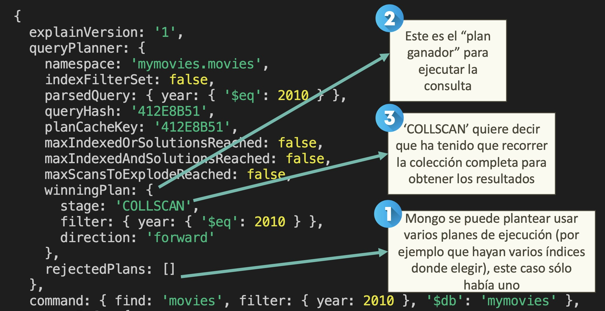

Lo suyo es decirle que te provea de la estadística de la ejecución de la consulta, para ello le añadimos _executionStats_:

```bash
db.movies.find({year: 2010}).explain("executionStats")
```

Y ahora se nos añade una sección muy interesante que se llama _executionStats_

```js
  executionStats: {
    executionSuccess: true,
    nReturned: 970,
    executionTimeMillis: 20,
    totalKeysExamined: 0,
    totalDocsExamined: 23530,
    executionStages: {
      stage: 'COLLSCAN',
      filter: { year: { '$eq': 2010 } },
      nReturned: 970,
      executionTimeMillisEstimate: 1,
      works: 23532,
      advanced: 970,
      needTime: 22561,
      needYield: 0,
      saveState: 23,
      restoreState: 23,
      isEOF: 1,
      direction: 'forward',
      docsExamined: 23530
    }
  },
```

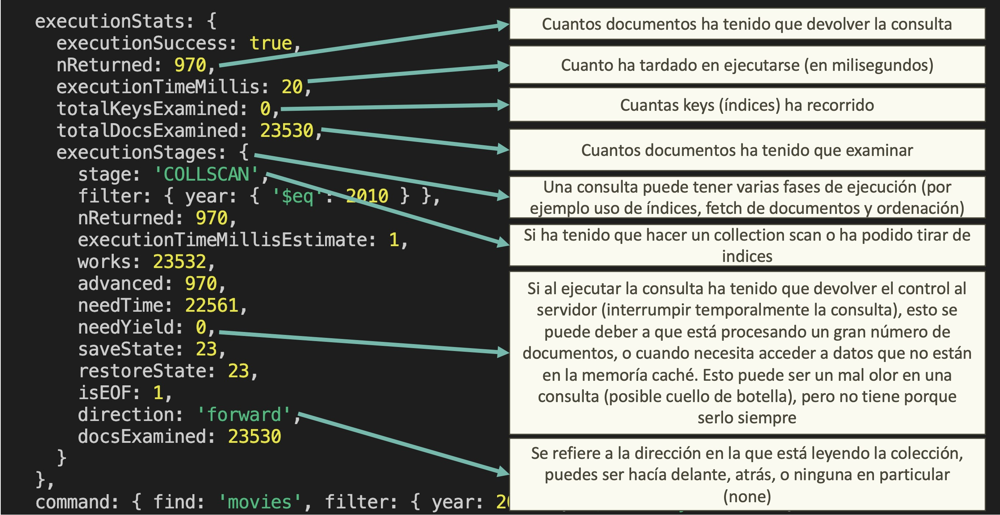

Los valores principales:

- `executionStats`: Cuantos documentos ha tenido que devolver la consulta
- `stage`: Si ha tenido que realizar un Collection Scan (recorrer toooda la colección) on un Index Scan (recorrer solo los índices).
- `totalKeysExamined`: Número de claves que ha tenido que examinar para devolver los resultados (aquí no tiramos de índices esto es cero).
- `nReturned`: Número de documentos devueltos.
- `totalDocsExamined`: Número de documentos que ha tenido que examinar para devolver los resultados.
- `executionTimeMillis`: Tiempo que ha tardado en ejecutar la consulta.
- `needYield`: Si al ejecutar la consulta ha tenido que devolver el control al servidor (interrumpir temporalmente la consulta), esto se puede deber a que está procesando un gran número de documentos, o cuando necesita acceder a datos que no están en la memoria caché. Esto puede ser un mal olor en una consulta (posible cuello de botella), pero no tiene por qué serlo siempre.
- `direction`: Se refiere a la dirección en la que está leyendo la colección, puedes ser hacía delante, atrás, o ninguna en particular (none).

Vamos a crear un índice para mejorar esta consulta, en este caso será sobre el campo _year_:

```bash
db.movies.createIndex({year: 1})
```

_¿Qué estamos haciendo aquí?_ Estamos creando un índice sobre el campo _year_ de la colección _movies_ con orden ascendente.

_¿Se ha creado el índice?_ Vamos a comprobarlo:

```bash
db.movies.getIndexes()
```

> Esto también podemos verlo (y crearlos) gráficamente en _Mongo Compass_ (pestaña _indexes_).

Si ahora lanzamos la misma consulta veremos unas estadísticas diferentes:

```bash
db.movies.find({year: 2010}).explain("executionStats");
```

En el _WinningPlan_

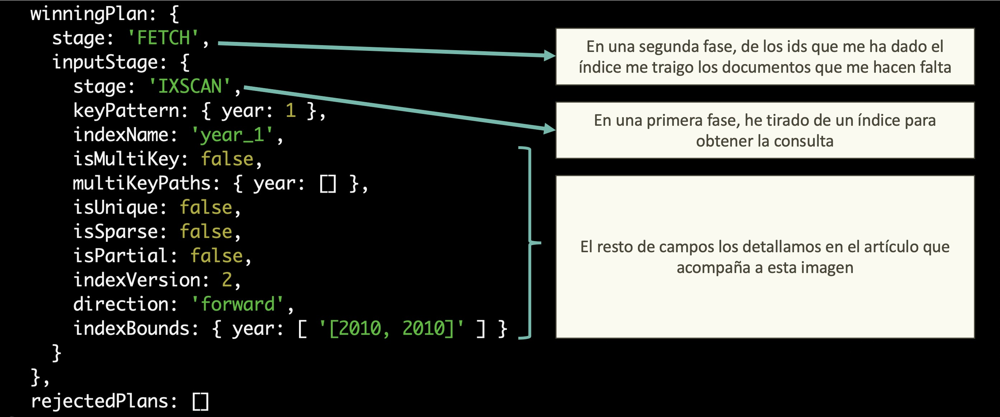

Vamos al detalle:

- `stage + inputStage:` fíjate que tenemos dos fases (una anidada dentro la otra), primero obtenemos los _ids_ de los documentos que cumplen con esa búsqueda utilizando el índice, y después hacemos un fetch de los documentos para poder mostrar los datos (ya veremos que en algunos casos hay un truco para evitar esto).
- `indexName`: El nombre del índice que se está usando.
- `isMultiKey` : si tenemos un índice sobre un campo array (lo veremos más adelante).
- `isSparse`: esto es útil cuando un campo solo viene informado en algunos documentos (imagínate que el campo cuenta _tiktok_ es opcional), si el índice es sparse solo se indexan los documentos que tienen ese campo.
- `isPartial`: este tipo de índices está muy chulo (lo veremos más adelante), pero imagínate que tienes pedidos y pueden tener varios estados, ¿Por qué no sólo indexar los que tengan el estado _inProgress_? Bien usado, en colecciones grandes puede ser muy útil (balance entre potencia del índice y ahorro en espacio).
- `indexVersion`: Esto es para para SysAdmins, indica qué versión del formato de índice se está usando.
- `indexBounds`: Aquí se muestra el rango de valores que se usó para la búsqueda en el indice, en este caso el rango está entre 2010 y 2010, sería interesante tirar una consulta por rangos de años y ver que valores ofrece.

En el execution stats, vamos a dividir esto en fases.

Primero el sumario:

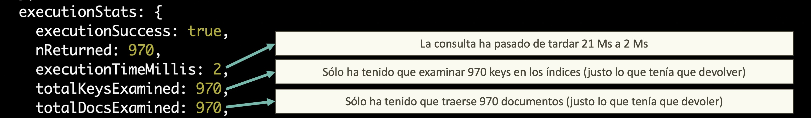

En detalle:

- `nReturned`: ha devuelto 970 documentos (lo esperado, igual que en la consulta sin índice).
- `executionTimeMillis`: pasamos de 21Ms a 2Ms.
- `totalKeysExamined`: solo ha tenido que examinar 970 claves en los índices (justo lo que tenía que devolver).
- `totalDocsExamined`: solo ha tenido que examinar 970 documentos (justo lo que tenía que devolver).

Vamos ahora a por cada fase, empezamos por la más interna y subimos a la más externa:

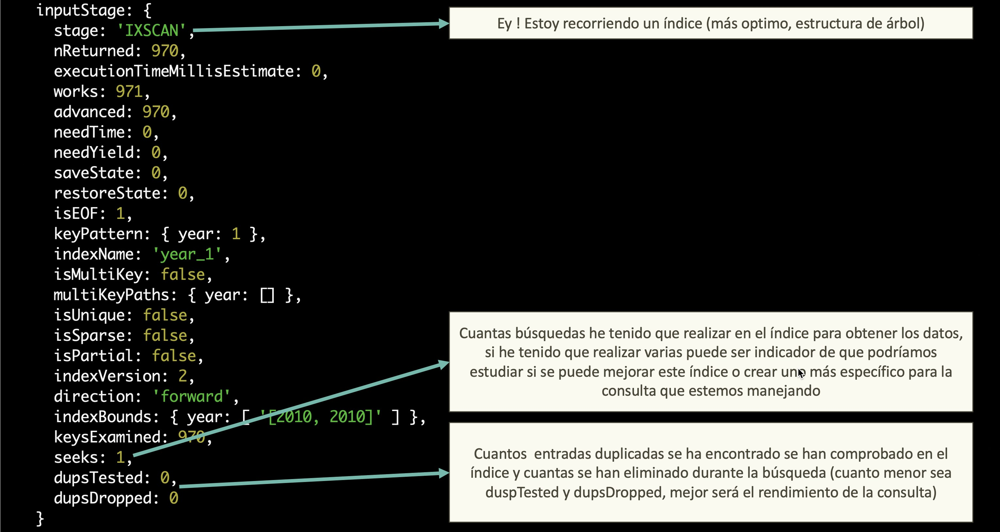

Aquí destacamos:

- `stage:` En este _stage_ nos indica que está recorriendo un índice.
- `seeks:` El número de búsquedas es uno.
- `dupsTested:` El número de entradas duplicadas en el índice es cero.

Vamos a por la fase siguiente (la superior).

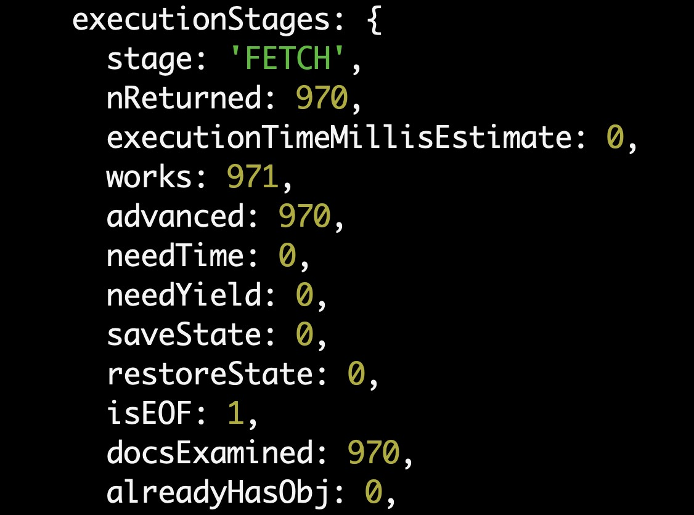

Aquí destacamos: indicamos que hacemos un FETCH para traernos documentos, y exactamente pedimos los 970 documentos que nos hacen falta.

## Queries más complejas

Tener un índice que sólo tiene en cuenta un campo, y una consulta que justo sólo filtra por ese campo está muy bien para un ejemplo, pero en la vida real solemos tirar consultas más complejas, vamos a subir un nivel y ver qué tal se porta esto ¿Será suficiente o tendremos que buscar una solución más elaborada?

Vamos a empezar a jugar con diferentes combinaciones de consultas y ver cómo se portan esto de índices de un sólo campo.

### Filtrando por más de un campo

### Aplicando rangos

Vamos a aprovechar que tenemos creado el índice sobre el campo _year_ y vamos a hacer una consulta que filtre por un rango de años.

```bash
db.movies.find({year: {$gte: 2010, $lte: 2015}}).explain("executionStats");
```

¿Qué creéis que va a pasar? En este caso:

- La consulta dura 7 milisegundos.
- Realiza un _IXScan_ y después un _Fetch_
- Se examinan 5970 claves y se devuelven 5970 documentos.
- El rango de valores _indexBound_ es de 2010 a 2015

### Combinado con filtrado

#### And

Vamos ahora a buscar películas que sean de 2010 y que tengan una duración mayor de 180 minutos.

Si hacemos un count tenemos que:

```bash
db.movies.find({year: 2010, runtime: {$gt: 180}}).count();
```

Hay sólo 6 películas que cumplen con esa condición.

Si pedimos el _explain_ de la consulta:

```bash
db.movies.find({year: 2010, runtime: {$gt: 180}}).explain("executionStats");
```

Tenemos que:

- Se examinan 970 claves y 970 documentos.
- Se devuelven 6 documentos (nReturned).
- Son menos de mil elementos, tarda poco 1 milisegundo.

¿Qué está pasando aquí? Pues que Mongo se da cuenta que lo más optimo es utilizar el índice por año y después iterar sobre él para buscar las películas que cumplan con la duración.

¿Qué pasaría si creamos un índice por la duración?

> Una nota sobre los índices, ojo un índice trae cuenta cuando hay un buen número de clase, por ejemplo, crear un índice sobre un campo booleano tendría sentido, ya que sólo tendríamos dos valores indexados.

Vamos a crear un índice por la duración:

```bash
db.movies.createIndex({runtime: 1});
```

Si volvemos a hacer la consulta:

```bash
db.movies.find({year: 2010, runtime: {$gt: 180}}).explain("executionStats");
```

Ahora tenemos cosas interesantes:

Por un lado, ya hay _pelea_ de _índices_ Mongo se da cuenta de que podría usar más de un índice para resolver la consulta, y elige el que mejor rendimiento tiene, fíjate en _winningPlan_ y _rejectedPlans_.

Wining plan

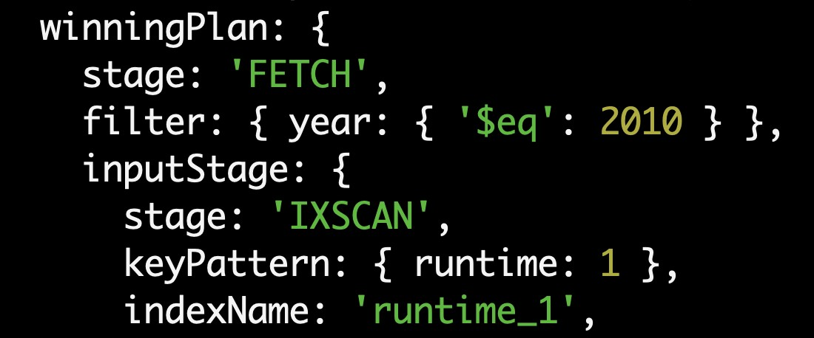

Rejected plans

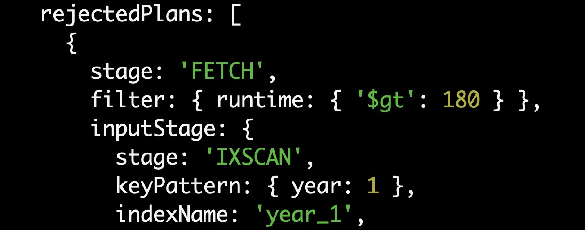

Si miramos las execution stats, vemos que el usando el índice sobre _runtime_ (IXScan stage) nos devuelve 370 documentos, cuando usamos el de _año_ nos devolvía 970.

> Si te fijas en milisegundos tarda un poco más (estamos hablando de consultas muy rápidas 1 a 3 Ms no sería tan representativo).

¿Y si pusiéramos una condición muy laxa en duración, por ejemplo, que dure más de un minuto? (nos va a devolver una burrada de documentos).

```bash
db.movies.find({year: 2010, runtime: {$gt: 1}}).explain("executionStats");
```

En este caso elije tirar por el índice de año, ya que nos da un subconjunto más pequeño de documentos.

> MongoDB utiliza un optimizador de consultas para seleccionar el índice más adecuado para cada consulta y generar planes de ejecución posibles. Luego, selecciona el plan de ejecución más eficiente utilizando la estimación de coste para minimizar el número de operaciones de entrada salidas necesarias para la consulta.

¿Podemos forzar a mongo a elegir un índice? Si, con _hint_ vamos a decir que use el índice de duración.

```bash
db.movies.find({year: 2010, runtime: {$gt: 1}}).hint({runtime: 1}).explain("executionStats");
```

Cuando forzamos a que use este índice podemos ver que los resultados son bastante más malos:

- Tenemos que examinar 23077 claves y documentos para devolver 937 documentos.
- Tarda en ejecutarse 46 Ms
- Eso sí... no hay _rejectedPlans_ ;).

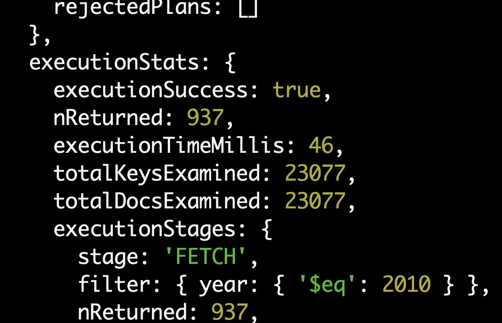

Salvo que sepamos muy bien lo que estemos haciendo, no es recomendable usar _hint_.

¿Y por qué no se usan los dos índices? Buena pregunta, que opciones tenemos:

- MongoDB puede utilizar intersección de índices, pero depende de la consulta, y no siempre vas a tener mejor rendimiento.
- Veremos más adelante que una práctica común es crear índices compuestos (es decir indexar por más de un campo), [según los chicos de MongoDB este tipo de índices son más eficientes que la intersección de índices](https://jira.mongodb.org/browse/SERVER-3071?focusedCommentId=508454&page=com.atlassian.jira.plugin.system.issuetabpanels%3Acomment-tabpanel#comment-508454).

#### Or

Vamos a probar ahora a hacer una _or_ con dos condiciones, por ejemplo, que la película sea de 2010 o que la duración sea mayor de 180 minutos.

```bash
db.movies.find({$or: [{year: 2010}, {runtime: {$gt: 180}}]}).explain("executionStats");
```

Aquí si tenemos un resultado interesante, al ser una OR:

- Mongo añade una fase de subplan y una stage OR.
- Para la parte en la que se filtra por año aplica el índice de año.
- Para la parte en la que se filtra por duración aplica el índice de duración.
- Se mezclan los resultados y se devuelven.


### Ordenación

Vamos ahora a jugar con la ordenación.

#### Ascendente

¿Qué pasa si queremos ordenar por año de forma ascendente?

¿Qué índices tenemos?

```bash
db.movies.getIndexes()
```

Vamos a borrar el índice de año:

```bash
db.movies.dropIndex("year_1")
```

```bash
db.movies.find({}).sort({year: 1}).explain("executionStats");
```

Aquí volvemos a nuestro amigo _COLLSCAN_ y tenemos que la operación tarda 53 Ms (executionTimeMillisEstimate).

Vamos a volver a crear el índice y ver si mejoramos algo los resultados.

```bash
db.movies.createIndex({year: 1})
```

```bash
db.movies.find({}).sort({year: 1}).explain("executionStats");
```

Si nos fijamos aquí tenemos:

- Volvemos a la combinación de FETCH e IXSCAN.
- Se hace uso del índice _year_1_ para ordenar los resultados.
- Bajamos a 26 milisegundos la ejecución.

¿Y si combinamos duración y ordenar por año?

```bash
db.movies.find({runtime: {$gt: 180}}).sort({year: 1}).explain("executionStats");
```

En tu caso, es probable el índice de duración se usa como el índice principal en la consulta porque el criterio de búsqueda por duración tiene una mayor selectividad que el criterio de búsqueda por año de publicación. Como resultado, MongoDB puede optar por usar el índice de duración para filtrar los documentos y luego ordenarlos en memoria.

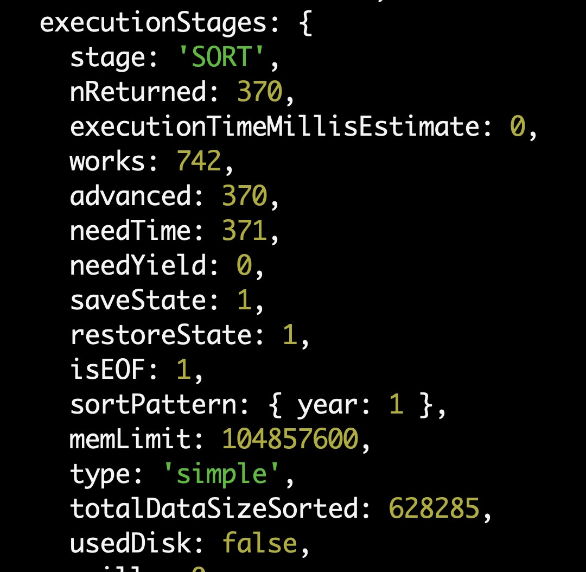

¿Y si probamos a tener un filtro de duración muy laxo? Películas que duren más de 10 minutos.

```bash
db.movies.find({runtime: {$gt: 10}}).sort({year: 1}).explain("executionStats");
```

Esto devuelve un porrón de resultados, así que el planificador de _MongoDB_ prefiere utilizar el índice de año y tirar de este índice para la ordenación.

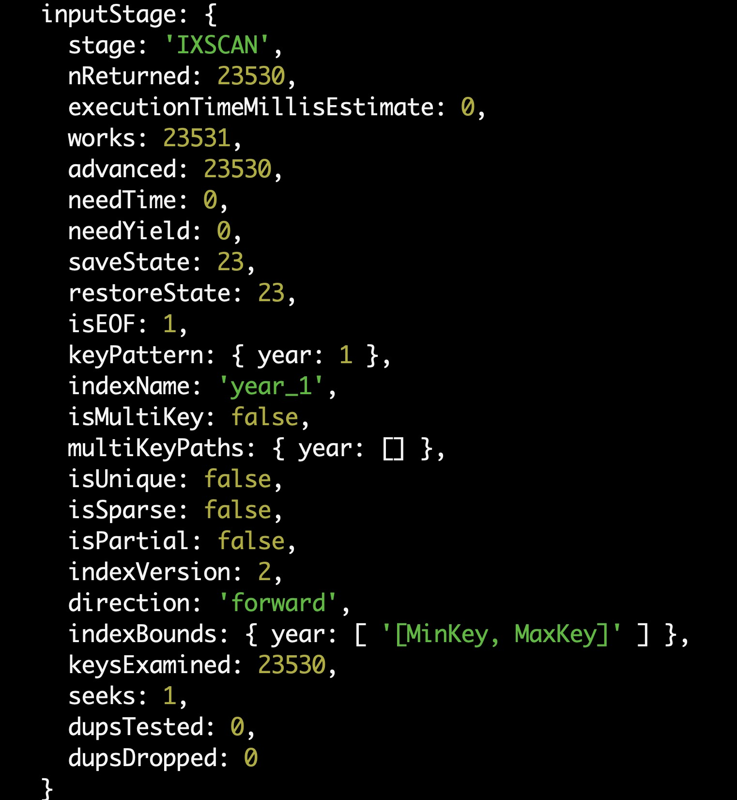

#### Descendente

Para terminar, si te fijas el índice de año es ascendente, ¿qué pasa si queremos ordenar por año de forma descendente?

```bash
db.movies.find({}).sort({year: -1}).explain("executionStats");
```

Pues que se usa el índice, pero esta vez va en dirección contraria leyéndolo (_backward_), no nos hace falta crear un índice para descendente y otro ascendente en este caso.

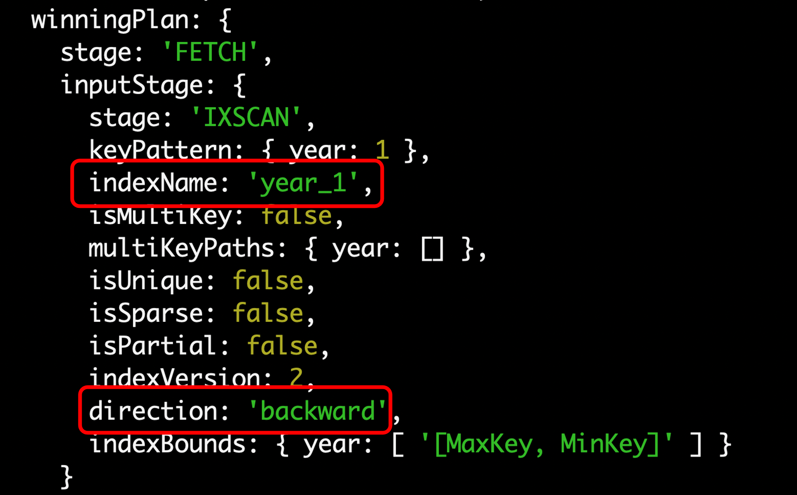

### Strings, RegEx y Text Search

Si queremos hacer búsquedas en un string nos podemos encontrar con sorpresas desagradables:

- Si buscamos por una cadena exacta, los índices estándares nos pueden valer.
- Si buscamos con una expresión regular, sólo nos va a sacarle provecho al índice si buscamos un string que empiece por...

En general si queremos hacer búsquedas en un string, lo mejor es crear un índice de tipo _text_, o si estamos en ATLAS te ofrecen un [ATLAS Text Search](https://www.mongodb.com/community/forums/t/mongodb-atlas-search-indexes-performance-as-compared-to-a-local-mongo-instance/207225), pero ojo que ahí tienes que pillar máquina (además es un servicio aparte basado en _Apache Lucene_, esta tecnología de base se usa también en _ElasticSearch_), otra alternativa puede ser _Algolia_.

Bueno hasta aquí toda la teoría vamos a ver que esto es así... :)

Vamos a por el campo título de película, vamos a crear un índice normal:

```bash
db.movies.createIndex({title: 1})
```

Vamos a buscar por un título exacto:

```bash
db.movies.find({title: "Blade Runner"}).explain("executionStats");
```

¡Qué bien!

Ahora vamos a buscar por una expresión regular, todas las pelis que empiecen por _star wars_:

```bash
db.movies.find({title: /^Star Wars/}).explain("executionStats");
```

¡¡Toma resultados!!

Vale, pues ahora vamos a buscar por una expresión regular todas las pelis que contengan _wars_:

```bash
db.movies.find({title: /wars/}).explain("executionStats");
```

Buf, vaya esto no va

Existen índices de tipo _text_ que nos permiten hacer búsquedas en strings, y un motor de búsqueda en el hosting de Mongo Atlas, pero esto lo cubriremos más adelante.

### Arrays

Antes de nada, vamos a volver a la base de datos de _mymovies_ para esto hacemos un _use_ de la base de datos:

```bash
use mymovies
```

### Indices únicos

Hay ocasiones en los que tenemos campos de los que estamos seguros que vamos a tener valores únicos, por ejemplo:

- El ISBN de un libro.
- El DNI de una persona.
- El Email de un usuario.

Es más, si esto no es así preferimos dar un error que tener datos duplicados.

Si lo tienes claro, puedes indicar a _MongoDB_ que cree un índice único para ese campo, supongamos que tenemos una colección de cuentas de usuarios y un campo _email_, vamos a crear un índice único para este campo:

```bash
db.users.createIndex({email: 1}, {unique: true})
```

Estos índices están más optimizados para búsquedas, pero si intentamos insertar un documento con un valor de email que ya existe, nos dará un error:

```bash
db.users.insertOne({
  _id: ObjectId("60fd8cc6e8171ee4f3ad7681"),
  name: "Eddard Stark",
  email: "sean_bean@gameofthron.es",
  password: "$2b$12$UREFwsRUoyF0CRqGNK0LzO0HM/jLhgUCNNIJ9RJAqMUQ74crlJ1Vu"
})
```

Aquí tendríamos el error:

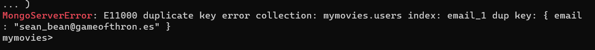

### Indices parciales

Hay veces que puede que nos interese crear un índice para un campo, pero sólo para aquellos documentos que cumplan una condición.

Por ejemplo:

- Tengo una lista de carritos de la compra enorme, y donde está el 90% del tráfico es en los carritos que están activos.
- ¿Por qué no crear un índice que cubra sólo el estado _active_?

```bash
db.carts.createIndex({status: 1}, {partialFilterExpression: {status: "active"}})
```

Antes de continuar vamos a eliminar los índices de película y partimos de cero:

```bash
db.movies.dropIndexes();
```

> Esto lo borra todo menos el de _id_

Como curiosidad se puede montar una función para ver que índices borrar

```bash
db.movies.getIndexes().forEach(function(index) {
  if (index.name !== '_id_') {
    db.movies.dropIndex(index.name);
  }
})
```

En nuestro caso vamos a hacer un índice parcial para películas que se hayan estrenado a partir de 2010:

```bash
db.movies.createIndex({year: 1}, {partialFilterExpression: {year: {$gte: 2010}}})
```

[Más información acerca de índices parciales](https://www.mongodb.com/docs/manual/core/index-partial/)

Vamos a lanzar una consulta de películas que se hayan estrenado a partir de 2012:

```bash
db.movies.find({year: {$gte: 2012}}).explain("executionStats");
```

Fíjate que aquí se aplica el índice.

¿Y si pedimos películas que se estrenaron antes de 1998?

```bash
db.movies.find({year: {$lt: 1998}}).explain("executionStats");
```

Anda, no hay índice... tenemos un COLLSCAN

¿Y si hacemos algo mixto, pelís que se estrenaron después de 1998?

```bash
db.movies.find({year: {$gte: 1998}}).explain("executionStats");
```

Aquí también tiramos de COLLSCAN

> Otro índice interesante es el SPARSE que sólo indexa los documentos que tengan ese campo informado.

# Multikey index, array fields in index

Además de campos simples, podemos crear índices en campos array o subdocumentos.

Una limitación importante: sólo podemos indicar un campo de tipo array por índice (esto nos afectará cuando creemos campos compuestos).

Vamos a sacar una consulta en la que vamos a mostrar del campo genres (un array con géneros) todos los géneros distintos

```bash
db.movies.distinct("genres").sort()
```

La lista de géneros que nos salen:

```js
[
  "Action",
  "Adventure",
  "Animation",
  "Biography",
  "Comedy",
  "Crime",
  "Documentary",
  "Drama",
  "Family",
  "Fantasy",
  "Film-Noir",
  "History",
  "Horror",
  "Music",
  "Musical",
  "Mystery",
  "News",
  "Romance",
  "Sci-Fi",
  "Short",
  "Sport",
  "Talk-Show",
  "Thriller",
  "War",
  "Western",
];
```

¿Analizamos la consulta a ver que tal ha ido?

```bash
db.movies.explain("executionStats").distinct("genres")
```

> Tenemos que poner explain primero, porque _distinct_ no genera un cursor

Tenemos que:

- Ha hecho un _COLLSCAN_
- Ha recorrido los 23500 documentos.
- Ha tardado 11 milisegundos.

Vamos a crear un índice en el campo genres:

```bash
db.movies.createIndex({genres: 1})
```

Vamos a repetir la consulta:

```bash
db.movies.explain("executionStats").distinct("genres")
```

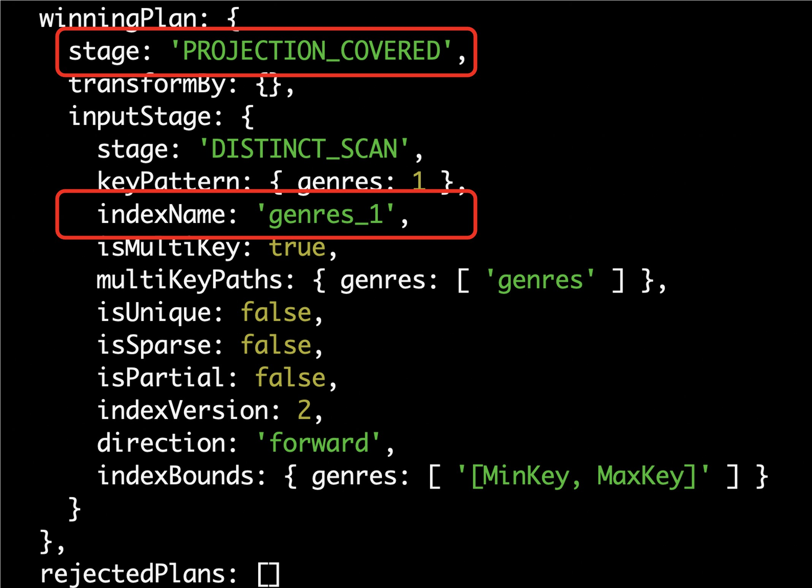

Veamos las stats:

- Se hace uso del índice.
- Se examinan sólo 26 keys.
- Se hace un scan.
- Me da un resultado por debajo del milisegundo.
- ¡No se hace fetch! Los campos que devolvemos en la consulta ya están en el índice y no hay que ir a buscarlos, esto veremos que es una optimización muy interesante cuando trabajemos con índices compuestos.
- Y un último tema fíjate que ahora _isMultiKey_ aparece como _true_ y los _multiKeysPath_ se indica que es el campo _genres_

Ahora vamos a hacer otra consulta, esta vez filtrar por las películas de ciencia ficción:

```bash
db.movies.find({genres: "Sci-Fi"}).explain("executionStats");
```

En esta colección de movies todos los campos arrays son tipos primitivos, pero se puede crear un indice de un campo de un objeto de un array.

¿Qué pasa si son subdocumentos? Tenemos que probarlo

# Indices compuestos

Hasta ahora hemos creado índices por un sólo campo, pero normalmente en las consultas filtramos y ordenamos por varios campos.

Para partir de algo en limpio vamos a borrar todos los índices de la colección movies:

```bash
db.movies.dropIndexes();
```

Vamos a ver qué pasa si creo una consulta en la que quiero que me saque por pantallas las películas de ciencia ficción, que se estrenaron después de 2010 y ordenadas por año:

```bash
db.movies.find({genres: "Sci-Fi", year: {$gte: 2010}}).sort({year: 1}).explain("executionStats");
```

Tenemos un _COLLSCAN_ como era de esperar

¿Y si creamos un índice en el campo genres y otro para year?

```bash
db.movies.createIndex({genres: 1});
```

```bash
db.movies.createIndex({year: 1});
```

Vamos a volver a tirar la consulta:

```bash
db.movies.find({genres: "Sci-Fi", year: {$gte: 2010}}).sort({year: 1}).explain("executionStats");
```

Aquí tenemos que:

- Ha devuelto 279 documentos.
- Ha realizado la ordenación en memoria.
- Ha tardado 15 milisegundos
- Ha usado el índice por año.

¿Podemos mejorar esto? ¿Y si tuviéramos un índice por el campo genres y year?

```bash
db.movies.createIndex({genres: 1, year: 1});
```

Vamos a volver a probar a tirar la consulta:

```bash
db.movies.find({genres: "Sci-Fi", year: {$gte: 2010}}).sort({year: 1}).explain("executionStats");
```

Aquí tenemos que:

- Solo tarda 2 milisegundos.
- No le hace falta hacer la ordenación en memoria.
- Fíjate que aquí elije el índice compuesto y tenemos la propiedad _isMultikey_ a true.

¿Este índice me sirve sólo para esta combinación? No, también me puede valer para otras, volvemos a borrar los índices y esta vez vamos a crear un índice por tres campos: genres, year y title:

```bash
db.movies.dropIndexes();
```

```bash
db.movies.createIndex({genres: 1, year: 1, title: 1});
```

Vamos ahora a tirar una consulta en la que queremos que me saque las películas de ciencia ficción que se estrenaron después de 2010 y ordenadas por año:

```bash
db.movies.find({genres: "Sci-Fi", year: {$gte: 2010}}).sort({year: 1}).explain("executionStats");
```

Vemos que ha tirado del índice y todo genial.

¿Y si quisiéramos que nos devolvieras las películas de ciencia ficción y ya está?

```bash
db.movies.find({genres: "Sci-Fi"}).explain("executionStats");
```

¡Usa el índice ! Esto es porque el índice empieza por _sci-fi_ entonces es capaz de usarlo (corta y no usa el resto).

Vale, vamos a seguir probando, ¿Si quiero las películas de ciencia ficción y ordenadas por año?

```bash
db.movies.find({genres: "Sci-Fi"}).sort({year: 1}).explain("executionStats");
```

Todo ok

Vamos a empezar a hacer combinaciones más raras ¿Y si quiero las películas de ciencia ficción, ordenadas por título?

```bash
db.movies.find({genres: "Sci-Fi"}).sort({title: 1}).explain("executionStats");
```

Aquí el sort lo ha hecho en memoria.

Y ¿Oye si tengo un índice por genres y year lo puedo aprovechar para hacer una consulta por el campo year?

```bash
db.movies.find({year: {$gte: 2010}}).explain("executionStats");
```

Fíjate que aquí hace un _COLLSCAN_ y no usa el índice, ¿Por qué? Porque el árbol del indice parte de _genres_, no hay forma de que salte en medio.

Sin embargo, si hacemos el siguiente índice:

```bash
db.movies.createIndex({year: 1, genres: 1});
```

Ahora sí que tira de ese índice:

```bash
db.movies.find({year: {$gte: 2010}}).explain("executionStats");
```

## Multikeys

¿Qué pasa si queremos usar un índice compuesto con campos arrays?

Vamos a intentar crear un índice compuesto por dos campos arrays, _genres_ y _cast_:

```bash
db.movies.createIndex({genres: 1, cast: 1});
```

```bash
MongoServerError: Index build failed: d4ecae56-e7ee-400b-94c4-5cbbeec78ae3: Collection mymovies.movies ( 6358cefa-d9f2-4e53-a4e0-11da863ad200 ) :: caused by :: cannot index parallel arrays [cast] [genres]
```

Nos da un error, ¿Por qué? Porque no se puede crear un índice compuesto por dos campos arrays.

Lo que si podemos hacer es crear un índice compuesto por un campo array y varios no array.

## ESR

ESR son las siglas de **E**quality **S**ort **R**ange y es un consejo a la hora de ordenar los campos de un índice compuesto:

- **Primero Equality:** es cuando comparamos algo con un resultado concreto (por ejemplo, año es igual 2010), es una forma muy rápida de que el índice elija justo esas entradas.
- **Segundo Sort:** Si estamos ordenando la consulta por un campo en concreto, esta es nuestra segunda opción, ya hemos reducido el número de documentos que tenemos que ordenar con equality, vamos a aprovechar para ordenarlos.
- **Tercero Consultas de rango:** En este tipo de consultas, pedimos valores que sean mayores que o menores que (por ejemplo, películas entre el 2010 y el 2015), aquí tenemos que acotar el rango lo máximo posible, MongoDB no puede hacer tirar de índices al resultado de tipo rango.

[Más informacíon al respecto sobre ESR](https://www.mongodb.com/docs/manual/tutorial/equality-sort-range-rule/)

Vamos a hacer una prueba:

Borramos índices de la colección de _movies_ por si acaso:

```bash
db.movies.dropIndexes();
```

Vamos a crear una consulta en la que queremos que nos devuelva las películas de ciencia ficción que se estrenaron después de 2010 y ordenadas por título:

```bash
db.movies.find({genres: "Sci-Fi", year: {$gte: 2010}}).sort({title: 1}).explain("executionStats");
```

Sin índices, como siempre, un collscan como un castillo, recorre 23000 documentos y tarda 23 milisegundos.

Vamos a crear un índice sin tener en cuenta ESR, por ejemplo, por año, título y género:

```bash
db.movies.createIndex({year: 1, title: 1, genres: 1});
```

Este índice se llama (year_1_title_1_genres_1).

Probamos la consulta de nuevo:

```bash
db.movies.find({genres: "Sci-Fi", year: {$gte: 2010}}).sort({title: 1}).explain("executionStats");
```

Tenemos que ha tardado 24 milisegundos, devuelve 279 documentos, pero ha tenido que leer 7145 keys en el índice.

¿Nos animamos a crear un índice siguiendo ESR?

- El primer campo sería género porque es un equality (voy al grano y reduzco elementos del tirón).
- Después iría el sort por título (salimos del equality, y podemos aprovechar el índice para que haga un sort).
- Y como paso final vamos a por el rango, que es el año (que el que da más vueltas para obtener los datos).

```bash
db.movies.createIndex({genres: 1, title: 1, year: 1});
```

Repetimos la consulta:

```bash
db.movies.find({genres: "Sci-Fi", year: {$gte: 2010}}).sort({title: 1}).explain("executionStats");
```

Este se llama: genres_1_title_1_year_1

Fíjate qué si empezamos a mirar las stats, tenemos que, para empezar:

- Ha elegido el nuevo índice sobre el que creamos antes (ese está como rejected)
- Hemos examinado sólo 991 key para devolver 279.
- Ha tardado 5 milisegundos !!

Y si nos fijamos en las executionStages:

- Tira por un IXScan
- No le hace falta hacer un sort en memoria
- Hace un FETCH para sacar los documentos.

Si encima tuviéramos la suerte de que sólo nos hiciera falta los campos que están en el índice para mostrarlos en pantalla, no tendríamos que hacer el _FETCH_ de los documentos:

```bash
db.movies.find({genres: "Sci-Fi", year: {$gte: 2010}}, {_id: 0, title: 1}).sort({title: 1}).explain("executionStats");
```

Aquí si te obtenemos un stage _PROJECTION_COVERED_ en vez de un _FETCH_ y el tiempo de ejecución se reduce a 3 milisegundos, no hemos tenido que ir a traernos los documentos, directamente con los campos del índice se pueden sacar.

Cuando estás probando con varios índices no es mala idea jugar con _hint_ y forzar a que use un índice en concreto, para ver los resultados completos del execution stats:

```bash
db.movies.find({genres: "Sci-Fi", year: {$gte: 2010}}, {_id: 0, title: 1}).sort({title: 1}).hint({genres: 1, title: 1, year: 1}).explain("executionStats");
```

# Borrando índices

Ya hemos visto como borrar índices con DropIndex, lo malo de esta opción es que en un DataSet grande después tener que volver a armarlo se puede comer muchos recursos.

Una opción interesante, es decir:

- Oye quiero que sigas manteniendo el índice.
- Pero no quiero que lo uses en las consultas hasta próximo aviso.

Esto lo podemos hacer con _HideIndex_

```bash
db.movies.hideIndex({genres: 1, title: 1, year: 1});
```

# Otros índices

## TTL indexes

Hay situaciones en las que cuando insertamos documentos en una colección no queremos que perduren para siempre, por ejemplo, si tratamos con datos de una sesión de usuario, o cachés, u otros elementos temporales.

¿Cómo solíamos tratar esta casuística con otros motores de base de datos relacionales?

- O bien haciendo procesos manuales de limpia cada X tiempo.
- O bien teniendo demonios o triggers que se disparan cada X tiempo.

¿Cómo podemos hacer esto con _MongoDb_? Utilizando los _Time To Leave Indexes_, también conocidos como índices _TTL_: la forma que tienen de funcionar es muy interesante, tú le añades a cada documento un campo fecha en el que le indicas cuando se creó el mismo, y después creas un índice en el que sobre ese campo fecha (timestamp), le das un tiempo de expiración en segundos (60 segundos, 1 hora, 48 horas... lo que mejor te venga).

Veamos cómo funciona esto con un ejemplo.

Crear una base de datos de prueba:

```bash
use miprueba
```

Vamos a crear una colección que llamaremos _sesiones_

```bash
db.createCollection('sesiones');
```

Definimos un _Time To Leave Index_, y le indicamos al motor de _mongo_ que esa colección va a tener un campo que lo llamaremos _fechaCreacion_ y que periódicamente, chequee y borre los documentos que hayan expirado, es decir borrar si: fecha hora actual < fechaCreación + 10 segundos.

```bash
db.sesiones.createIndex({ fechaCreacion: 1 }, { expireAfterSeconds: 10 });
```

Vamos a probar que esto funciona, insertamos una entrada, y utilizando
_new Date()_ le indicamos que en _fechaCreacion_ guarde la fecha y hora
actual.

```js
db.sesiones.insertOne({
  fechaCreacion: new Date(),
  datos: "Prueba de contenido A",
});

Si le echamos un ojo rápido, podemos ver que el documento sigue existiendo:

```js
db.sesiones.find({});
```

Si esperamos justo los 10 segundos y ejecutamos otra vez la consulta puede ser que sigamos viendo el documento, _¿qué pasa aquí?_ MongoDb lanza cada 60 segundos un proceso interno que es el que recorre los índices TTL y se pone a borrar los documentos que hayan caducado, además, esto también puede tardar un poco más dependiendo de la carga que tenga el servidor en ese momento, esto no suele ser problema ya que lo normal es que manejemos tiempos de expiración más elevados (por ejemplo, una sesión suele durar mínimo 30 minutos).

Vamos a probar si Mongo ha hecho su trabajo, volvemos a ejecutar el _find_ y vemos que ya el documento no está:

```js
db.sesiones.find({});
```

Si te animas, puedes poner un tiempo de expiración más elevado y probar a insertar elementos en diferentes tiempos y comprobar como unos documentos se van borrando y otros se quedan dependiendo del timestamp que tenga cada campo fecha.

Como curiosidad, otra forma interesante de gestionar la expiración en los índices TTL es crearlos con un tiempo de expiración de 0 segundos y directamente estableciendo en cada documento la fecha de expiración a futuro, así cuando se llegue a dicha fecha/hora el demonio de MongoDb lo eliminará.

## Text Indexes

Cómo comentamos en un apartado de _String, RegEx y Text Search_, vamos a ver cómo tratar los índices de tipo _text_ en MongoDb, los cuales nos permiten realizar búsquedas de texto en campos de tipo _string_. Para ello vamos a utilizar el dataset de _mymovies_ que ya hemos utilizado en otros apartados.

```bash
use mymovies

Vamos a hacer un drop de los índices:

```bash
db.movies.dropIndexes()
```

Ahora vamos a crearnos un índice por el campo _title_, y le indicamos que es de tipo texto:

```bash
db.movies.createIndex({title: "text"})
```

Para aprovechar el índice tenemos que usar la función _$text_ y luego el operador _$search_, y le pasamos la cadena que queremos buscar,
en este caso _wars_. Ejecutamos _executionsStats_ para ver el plan de ejecución:

```bash
db.movies.find({$text: {$search: "wars"}}).explain("executionStats");
```

Ahora sí, nos devuelve los resultados y vemos que ha utilizado para la consulta el índice _title_text_, examinó 125 documentos y la ejecución de la consulta duró 3 milisegundos.

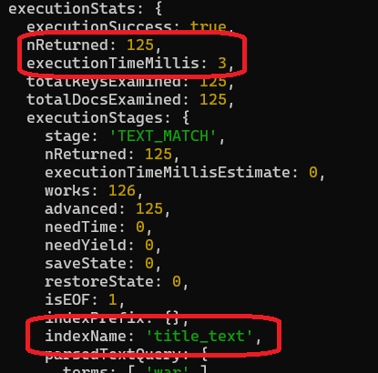

Los índices de búsquedas de texto son muy potentes, pero hay que conocer ciertos detalles de su
funcionamiento, o puede que no nos arrojen los resultados que esperamos.

En este ejemplo vamos a ver cómo obtener pesos de resultados de búsqueda, cómo excluir palabras, y cómo manejarnos en lenguaje castellano.

### Pesos de resultados de búsqueda

Vamos a crear una base de datos nueva que la llamaremos _clinica_, en ella tendremos una colección que se llamará _consultas_, esta colección tendrá un campo _diagnóstico_ que será de texto libre, y es donde el médico introduce el diagnóstico del paciente (esto es sólo para practicar, lo ideal sería normalizar dicha información en la base de datos).

Creamos la base de datos e insertamos unos datos de prueba:

```bash
use clinica
```

```js
db.consultas.insertMany([
  {
    nombre: "Juan Perez",
    especialidad: "general",
    diagnostico: "Dolor abdominal, Fiebre alta, tos, posible caso de COVID",
  },
  {
    nombre: "María Pelaez",
    especialidad: "general",
    diagnostico: "Tensión alta, posible episodio de ataque de ansiedad",
  },
  {
    nombre: "Javier Garcia",
    especialidad: "cardiología",
    diagnostico: "Arritmias, acompañado de tensión alta",
  },
  {
    nombre: "Manuel Gómez",
    especialidad: "general",
    diagnostico: "Fiebre alta, tos y mucosidades",
  },
]);
```

Vamos a crear un índice para el campo diagnóstico, como está en castellano, vamos a indicárselo en el _createIndex_, de esta manera, nos aseguramos que va a tratar bien los campos con tilde, caracteres especiales, identificar palabras que debe ignorar en una búsqueda como: a, de, con, ante, y...).

```js
db.consultas.createIndex(
  { diagnostico: "text" },
  { default_language: "spanish" }
);
```

Ahora podemos buscar _tensión_ con o sin tilde y obtenemos resultados:

```js
db.consultas.find({ $text: { $search: "tensión" } });
```

```js
db.consultas.find({ $text: { $search: "tension" } });
```

> Cabe mencionar que en el caso de que puedas tener campos con multiples idiomas, mongoDb te ofrece
> la opción _language override_

Otro tema muy interesante es evaluar el tipo de resultado que nos da esta búsqueda: lo que hace este _$text $search_ es buscar por palabras, es decir si buscamos _tensión alta_ nos podemos encontrar una sorpresa

```js
db.consultas.find(
  { $text: { $search: "tension alta" } },
  { nombre: 1, diagnostico: 1 }
);
```

resultados

```javascript
[
  {
    _id: ObjectId("60fd4c5ce8171ee4f3ad7680"),
    nombre: "Juan Perez",
    diagnostico: "Fiebre alta, tos y mucosidades",
  },
  {
    _id: ObjectId("60fd4c5ce8171ee4f3ad767f"),
    nombre: "Javier Garcia",
    diagnostico: "Arritmias, acompañado de tensión alta",
  },
  {
    _id: ObjectId("60fd4c5ce8171ee4f3ad767e"),
    nombre: "María Pelaez",
    diagnostico: "Tensión alta, posible episodio de ataque de ansiedad",
  },
  {
    _id: ObjectId("60fd4c5ce8171ee4f3ad767d"),
    nombre: "Juan Perez",
    diagnostico:
      "Dolor abdominal, Fiebre alta, tos y falta de secrecciones nasales, posible caso de COVID",
  },
];
```

Resulta que también nos da como primer resultado _fiebre alta_ _¿Comooor?_ bueno resulta que _alta_ existe en esa entrada..., _ok_, aceptamos barco, pero yo quiero que aparezca primero tensión alta _¿Qué está pasando aquí?_ Que no le indicamos que ordene los resultados por relevancia,
para hacer esto, _MongoDb_ le asigna a cada resultado de la consulta un peso, a más peso más palabras coinciden con lo que se está buscando, si ordenamos por relevancia podemos ver los resultados en el orden
que esperamos, veamos cómo hacer ésto:

Primero sacamos los pesos de relevancia, añadimos a la proyección de resultados un campo que llamaremos _score_ tiramos de los metadatos que nos da el índice de texto, en este caso el campo _textScore_.

```js
db.consultas.find(
  { $text: { $search: "tension alta" } },
  { nombre: 1, diagnostico: 1, score: { $meta: "textScore" } }
);
```

Veamos los resultados:

```javascript
[
  {
    _id: ObjectId("60fd8cc6e8171ee4f3ad7681"),
    nombre: "Juan Perez",
    diagnostico: "Dolor abdominal, Fiebre alta, tos, posible caso de COVID",
    score: 0.5625,
  },
  {
    _id: ObjectId("60fd8cc6e8171ee4f3ad7682"),
    nombre: "María Pelaez",
    diagnostico: "Tensión alta, posible episodio de ataque de ansiedad",
    score: 1.1666666666666667,
  },
  {
    _id: ObjectId("60fd8cc6e8171ee4f3ad7684"),
    nombre: "Juan Perez",
    diagnostico: "Fiebre alta, tos y mucosidades",
    score: 0.625,
  },
  {
    _id: ObjectId("60fd8cc6e8171ee4f3ad7683"),
    nombre: "Javier Garcia",
    diagnostico: "Arritmias, acompañado de tensión alta",
    score: 1.25,
  },
];
```

Esto empieza a tener sentido, _tensión alta_ tiene más peso que _fiebre alta_, ¿Y si ordenamos por ese campo?

```js
db.consultas.find(
    { $text: { $search: "tensíon alta" } },
    { nombre: 1, diagnostico: 1, score: { $meta: "textScore" } }
  ).sort({ score: { $meta: "textScore" } });
```

Ahora si nos aparece arriba _tension alta_.

```javascript
[
  {
    _id: ObjectId("60fd8cc6e8171ee4f3ad7683"),
    nombre: "Javier Garcia",
    diagnostico: "Arritmias, acompañado de tensión alta",
    score: 1.25,
  },
  {
    _id: ObjectId("60fd8cc6e8171ee4f3ad7682"),
    nombre: "María Pelaez",
    diagnostico: "Tensión alta, posible episodio de ataque de ansiedad",
    score: 1.1666666666666667,
  },
  {
    _id: ObjectId("60fd8cc6e8171ee4f3ad7684"),
    nombre: "Juan Perez",
    diagnostico: "Fiebre alta, tos y mucosidades",
    score: 0.625,
  },
  {
    _id: ObjectId("60fd8cc6e8171ee4f3ad7681"),
    nombre: "Juan Perez",
    diagnostico: "Dolor abdominal, Fiebre alta, tos, posible caso de COVID",
    score: 0.5625,
  },
];
```

Aunque... si queremos buscar exactamente tensión alta ¿Por qué no indicarle
que busque exactamente por ese substring?_, para hacer esto rodeamos el string _tensión alta_ entre comillas dobles.

```js
db.consultas.find(
  { $text: { $search: '"tensión alta"' } },
  { nombre: 1, diagnostico: 1 }
);
```

Otra opción interesante que nos permite este tipo de búsquedas es la de omitir resultados que tengan ciertas palabras, ésto lo hacemos añadiendo como prefijo un menos a la palabra que queramos hacer que descarte el resultado, por ejemplo, queremos buscar pacientes que hayan tenido fiebre, tos, pero no _mucosidades_, le añadimos un menos a _mucosidades_

```js
db.consultas.find(
    { $text: { $search: "fiebre tos -mucosidades" } },
    { nombre: 1, diagnostico: 1, score: { $meta: "textScore" } }
  ).sort({ score: { $meta: "textScore" } });
```

Los índices _text_ son una herramienta muy potente, pero hay que saber bien
cuando usarlos ya que:

- Tiene un coste generarlos.
- Pueden llegar a ocupar bastante memoria y disco duro.
- Pueden hacer que las escrituras sean más lentas.

### Ejemplo de pesos y lenguaje en Gastrocarta

[Gastrocarta](https://www.gastrocarta.net/) es un portal dedicado a la gastronomía, que ofrece información sobre restaurantes, bares, cafeterías, etc. 

En nuestro portal, tenemos un buscador que nos filtra los restaurantes por nombre, teléfono, dirección, etc. 

Y nos surgía una problemática con los hiatos, y es qué si buscábamos, por ejemplo, _Cervecería_ no nos aparecía ningún resultado, pero si buscábamos _Cerveceria_ sí que nos aparecían resultados, esto era debido a que en el índice de texto no se tienen en cuenta los acentos, y por lo tanto _Cervecería_ no es lo mismo que _Cerveceria_.

Para solucionar esto, añadimos a la creación del índice _default_language: 'spanish'_, al especificarle el lenguaje, ya se tienen en cuenta los acentos, y por lo tanto _Cervecería_ es lo mismo que _Cerveceria_.

También tuvimos en cuenta el orden de creación de los índices, para indicar cuáles eran los que tenían más peso en la búsqueda, por ejemplo, si buscamos _Cervecería_ nos aparecerán primero los resultados que tengan _Cervecería_ en el nombre, y luego los que tengan _Cervecería_ en la dirección, y por último los que tengan _Cervecería_ en descripción.

```bash
db.restaurantes.createIndex(
  {
    nombre: "text",
    direccion: "text",
    descripcion: "text",
  },
  {
    default_language: "spanish",
    weights: {
      nombre: 10,
      direccion: 5,
      descripcion: 1,
    },
  }
);
```
# Wildcard Indexes

Hay casos, en los que no sabemos sobre que campos se van a realizar las búsquedas, y tenemos que dar un buen rendimiento desde el día cero, una opción que tenemos es ir creando índices campo por campo, ...mantener esto puede convertirse en algo pesado.

_MongoDb_ a partir de la versión 4.2 nos ofrece los índices _WildCard_, que usando un carácter comodín (el asterisco) nos permite indicarle partir de qué nivel en el documento cree índices para todos los campos.

Veamos cómo funciona esto con un ejemplo:

Trabajaremos sobre el juego de datos de ejemplo _AirBnb_, lo primero que vamos a hacer es borrar todo los índices para asegurarnos de que partimos limpios.

```bash
use airbnb
```

```js
db.listingsAndReviews.dropIndexes();
```
Vamos trabajar con la colección _listingsAndReviews_ en concreto con el campo _reviews_score_, vemos que es un objeto que contiene 7 campos.

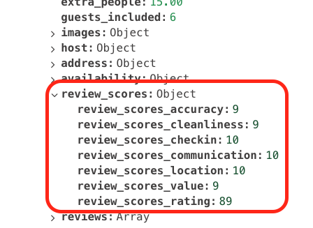

Este objeto tiene pinta de ser buen candidato para aplicar índices wildcard:

- Es una puntuación por varios tópicos (puntualidad, limpieza, comunicación, emplazamiento...).
- Es muy normal que no haya un patrón definido de búsqueda para estos campos.
- Es buena idea tenerlos todos indexados por si acaso.

Vamos a tirar un par de consultas y ver cómo se portan sin índices

```javascript
db.listingsAndReviews.find({
  "review_scores.review_scores_location": { $gte: 9 },
}).explain("executionStats");
```

```javascript
db.listingsAndReviews.find({
  "review_scores.review_scores_cleanliness": { $gte: 9 },
}).explain("executionStats");
```

Tenemos el problema de siempre, tiramos de _colscan_ y recorremos todos los documentos.

En vez de crear un índice por cada campo vamos a crear un _wildcard_ index:

- Le indicamos que queremos aplicarlo a partir del nivel de _reviews_score_
- Con el comodín _$\*\*_ le indicamos que cubra todos los campos de ese objeto.

```js
db.listingsAndReviews.createIndex({ "review_scores.$**": 1 });
```

Esto crea un índice por cada campo del objeto reviews_score, si ahora volvemos
a lanzar las consultas

```javascript
db.listingsAndReviews.find({
  "review_scores.review_scores_location": { $gte: 9 },
}).explain("executionStats");
```

```javascript
db.listingsAndReviews.find({
  "review_scores.review_scores_cleanliness": { $gte: 9 },
}).explain("executionStats");
```

Podemos ver que se están aplicando los índices y sólo recorremos los documentos que tienen una puntuación mayor que 9.

¿Y qué pasa si el campo es de tipo array? podemos crear también un índice de este tipo, veamos por ejemplo el campo _reviews_

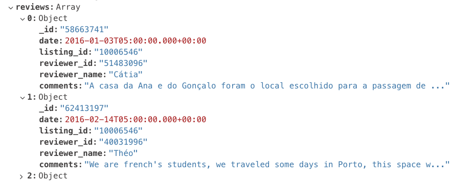

Vamos a tirar un par de consultas y ver cómo se portan sin índices

```javascript
db.listingsAndReviews.find({
  "reviews.date": { $gte: new Date("2019-03-03") },
}).explain("executionStats");
```

```javascript
db.listingsAndReviews.find({
  "reviews.reviewer_name": "Matt",
}).explain("executionStats");
```

Creamos un índice _wildcard_ que cubra todas las entradas de _reviews_:

```js
db.listingsAndReviews.createIndex({ "reviews.$**": 1 });
```

Ahora, si volvemos lanzar estás consultas podemos ver que los índices están
creados para todos los campos del objeto _reviews_, y las consultas tiene mejor rendimiento.

```javascript
db.listingsAndReviews.find({
  "reviews.date": { $gte: new Date("2019-03-03") },
}).explain("executionStats");
```

```javascript
db.listingsAndReviews.find({
  "reviews.reviewer_name": "Matt",
}).explain("executionStats");
```

Los índices _wildcard_ pueden ser de gran utilidad cuando no sabes a ciencia cierta sobre que va a filtrar el usuario, es un caso especial, no es un sustituto de los índices tradicionales, siempre tienes que estudiar el uso de tus datos, en algunas ocasiones puede ser mucho más útil un índice por múltiples campos que un _wildcard_.
# ATLAS

Si estás trabajando con el hosting oficial de Mongo (ATLAS), y tienes contratado un cluster (a partir de un M0), tienes un advisor para crear índices:

- Nos vamos a nuestro portal de ATLAS.
- Nos vamos a la pestaña de _Performance Advisor_.

Aquí aparecen varias cards en las que nos da consejos basado en el uso sobre que indices crear entre otras cosas.

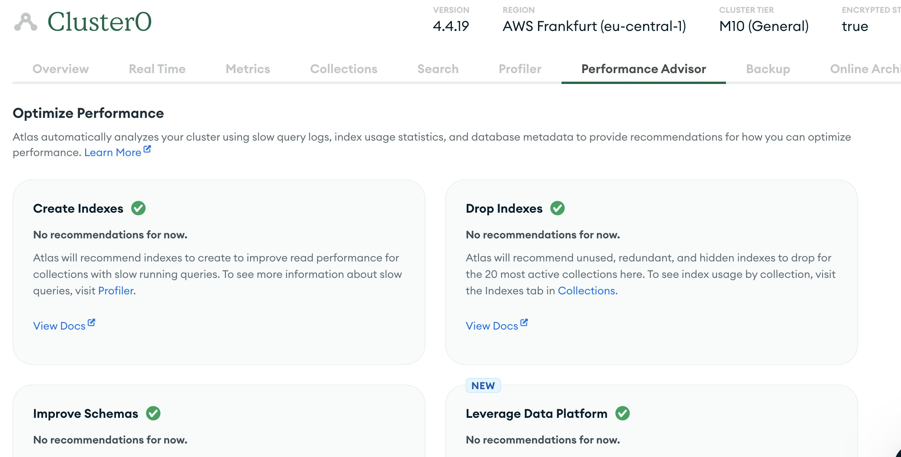

# Tooling Mongo Compass

En _Mongo Compass_, tenemos dos vistas interesantes:

- Explain plan: es una forma más gráfica de ver el explain plan de una consulta.
- Indexes: es una forma más gráfica de ver los índices que tenemos en una colección, también podemos crearlos etc.

Por ejemplo, vamos a lanzar la última consulta:

```bash
db.movies.find({genres: "Sci-Fi", year: {$gte: 2010}}, {_id: 0, title: 1}).sort({title: 1})).explain("executionStats");
```

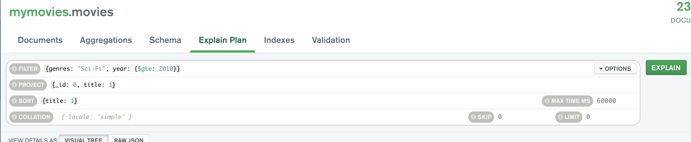


