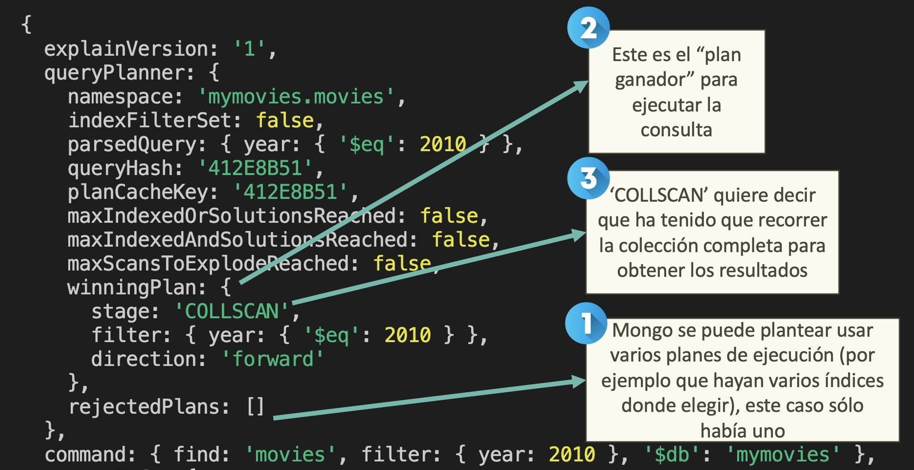
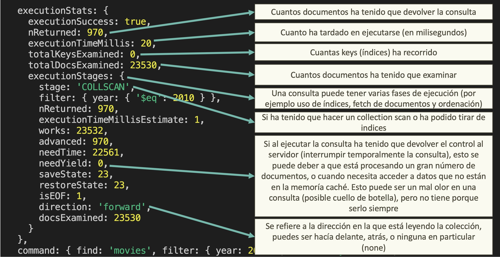
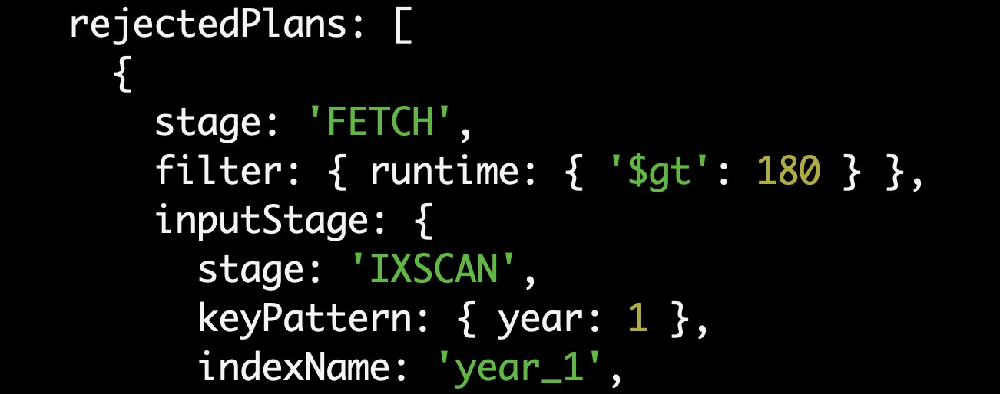
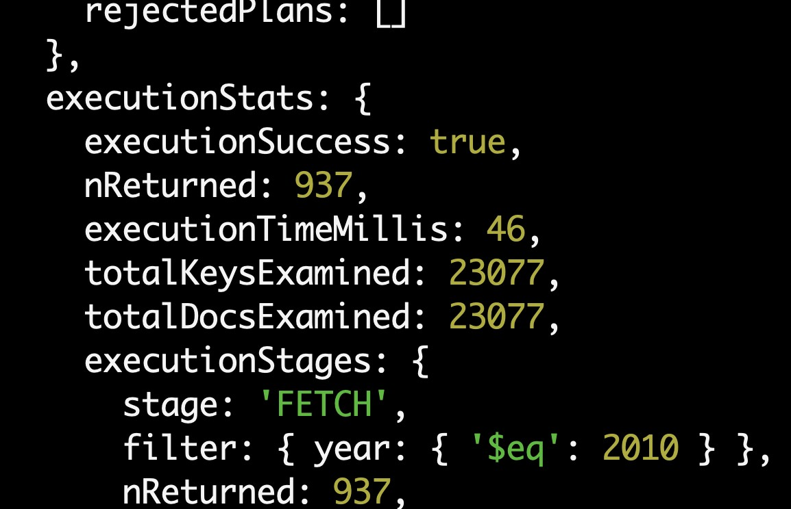
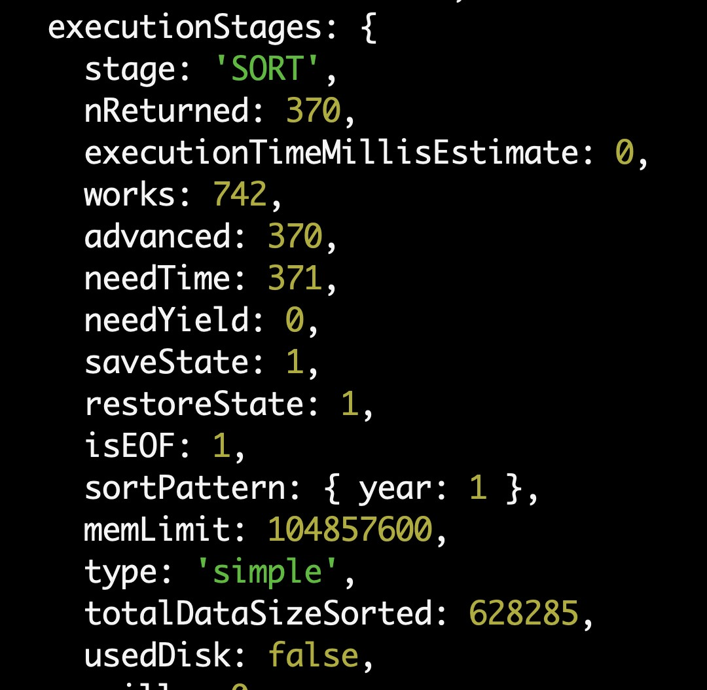
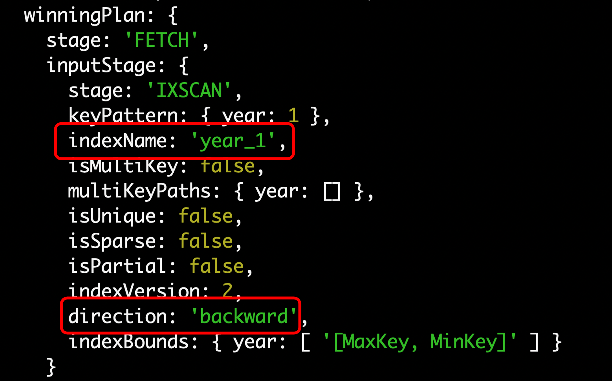

# Indices

## Para que sirven

Los índices en Mongo nos permiten hacer que una consulta tarde menos en ejecutarse, a cambio de que la inserción / actualización de datos sea más lenta.

Esto empieza a traer cuenta cuando tenemos colecciones grandes y consultas que se usan mucho y tardan en ejecutarse.

Primeras reglas de perogrullo cuando me planteo usar un índice:

- ¿Hay muchos datos?
- ¿Hay consultas que se usan mucho y tardan en ejecutarse? Es decir una consulta que tira un administrador de vez en cuando no nos debería de preocupar mucho.
- ¿Cuanto estoy escribiendo datos?

## ¿Cómo funcionan?

Cuando pensamos en un índice podemos pensar en un libro, la tabla de índice del final en la que podemos buscar por palabras clave y nos dice en que página está esa palabra.

Es decir si quiero buscar una palabra mejor que ir página por página, me voy a buscar en la parte de atrás y tardo menos, es decir:

- Si no utilizo el indice tendría que ir pagina por pagina buscando, eso es lo que en Mongo lo llamamos hacer un _collection scan_ (COLLSCAN).
- Si utilizo el indice, voy a la parte de atrás y me salto todas las páginas que no me interesan, esto es mucho más rápido es lo que en Mongo llamamos un _index scan_ (IXSCAN), pero ojo:
  - Estoy pagando el pato de _añadir páginas al libro_
  - Si el libro fuera online y estuviera vivo (el autor lo va actualizando), tendría que ir recalculando el índice cada vez que introdujera nuevas páginas (esto es lo que en Mongo se llama _reindexing_), y esto tiene un coste, lo podemos comparar con cuando un usuario introduce e

Los índices en Mongo son como un árbol binario, donde cada nodo es un documento de la colección.

¿Se puede usar más de un índice en una consulta?

- MongoDB soporta los XXXX en una consulta, pero normalmente no los usa ya que da peor rendimiento que un indice compuesto.

- Lo normal es que se use un sólo indice, a ser que tengamos una consulta con un OR que puede usar más de uno.

¿Los Indices son siempre igual de efectivos? No, si hacemos un matching exacto el índice es más efectivo que si hacemos una consulta por rango.

Que campos, no tiene sentido un indi e en un booleano por ejemplo

## Tipos de indices

Para empezar MongoDB nos crea un índice por cada campo **\_id**, así que ese campo ya lo tenemos cubierto.

Después podemos crear indices:

- Simples: Un índice que solo tiene un campo (por ejemplo el campo nombre de cliente).
- Compuestos: Un índice que tiene varios campos (por ejemplo el campo nombre de cliente y el edad).

Vamos a comprobarlo:

Entramos en el terminal interactivo:

```bash
docker exec -it my-mongo-db sh
```

Y dentro del contenedor, arrancamos en _mongo shell_:

```bash
mongosh
```

Y dentro del _mongo shell_ nos conectamos a la base de datos:

```bash
use mymovies
```

Y vamos a ver los indices que tenemos en la colección de _movies_:

```bash
db.movies.getIndexes()
```

# Hola My Movies

Vamos arrancarnos por los indices a aplicar a un campo simple.

En nuestro caso vamos a jugar por el campo _year_ de la colección _movies_, es un campo número que nos indica el año en que se estrenó la película.

Si por ejemplo queremos ver las películas que se estrenaron en el año 2010, podemos hacerlo de la siguiente forma:

```bash
db.movies.find({year: 2010})
```

Y si queremos contar cuantos resultados arroja:

```bash
db.movies.find({year: 2010}).count()
```

En 2010 se estrenaron un total de 970 películas.

Por curiosidad ¿Cuantas películas en total tenemos en la colección?

```bash
db.movies.count()
```

Algo más de 23.000 pelícuas.

Si te fijas esto ha dado una respuesta relativamente rápida ¿Por qué?

- Tenemos una buena máquina para desarrollar.
- No hay carga de otros usuarios accediendo.
- La colección no es muy grande, y igual en nada la tenemos cargada en el working set y en memoria.

¿Qué debemos tener en cuenta?

- No hay bala de plata, todo depende mucho de número de elementos, la de veces que se ejecute una consulta (no es lo mismo un sysadmin que ejecute una consulta al mes que tarde 5 segundos, que 200 usuarios concurrente ejecutando una consulta con diferentes valores que tarde 2 segundos).
- Si una colección tiene menos de 1000 elementos y la consulta es simple un indice igual no aporta demasiado.
- Si la colección es grande (por ejemplo, más de 10,000 documentos) y la consulta implica filtrar, ordenar o agrupar documentos basados en ciertos campos, es probable que se necesite un índice para mejorar el rendimiento de la consulta.
- Por otro lado, tenemos que preveer como va creciendo nuestra base de datos, crear un indice desde cero en una colección enorme tiene su coste.
- Una buena forma de ver si una consulta puede dar problemas es utilizar el comando _explain_ de Mongo (esto lo veremos en breve).
- En Mongo Atlas (Mongo siempre te va a empujar a que lo uses), tienes un Performance Advisor que te da recomendaciones en base a tu uso, existen opciones para deployments custom pero $$$:
  - [Mongo Ops Manager](https://www.mongodb.com/es/products/ops-manager)
  - [Solar Winds](https://www.solarwinds.com/database-performance-monitor)
  - [Studio T3](https://studio3t.com/)
- Si te vas a Mongo Atlas, recibes un aviso cuando una consulta tiene que escanear más de mil documentos.

# Indices simples

## Entendiendo Explain

Muy bien, ahora sabemos que hay ocasiones en que podemos usar indices, lo suyo es ver si una consulta nos la puede liar :).

En concreto vamos a analizar la consulta que hemos hecho antes, para ello le añadimos _explain_:

```bash
db.movies.find({year: 2010}).explain()
```

Si lo pongo a secas no me da mucha información, lo principal:

```js
{
  explainVersion: '1',
  queryPlanner: {
    namespace: 'mymovies.movies',
    indexFilterSet: false,
    parsedQuery: { year: { '$eq': 2010 } },
    queryHash: '412E8B51',
    planCacheKey: '412E8B51',
    maxIndexedOrSolutionsReached: false,
    maxIndexedAndSolutionsReached: false,
    maxScansToExplodeReached: false,
    winningPlan: {
      stage: 'COLLSCAN',
      filter: { year: { '$eq': 2010 } },
      direction: 'forward'
    },
    rejectedPlans: []
  },
  command: { find: 'movies', filter: { year: 2010 }, '$db': 'mymovies' },
  serverInfo: {
    host: '327fe2e4d48b',
    port: 27017,
    version: '6.0.5',
    gitVersion: 'c9a99c120371d4d4c52cbb15dac34a36ce8d3b1d'
  },
  serverParameters: {
    internalQueryFacetBufferSizeBytes: 104857600,
    internalQueryFacetMaxOutputDocSizeBytes: 104857600,
    internalLookupStageIntermediateDocumentMaxSizeBytes: 104857600,
    internalDocumentSourceGroupMaxMemoryBytes: 104857600,
    internalQueryMaxBlockingSortMemoryUsageBytes: 104857600,
    internalQueryProhibitBlockingMergeOnMongoS: 0,
    internalQueryMaxAddToSetBytes: 104857600,
    internalDocumentSourceSetWindowFieldsMaxMemoryBytes: 104857600
  },
  ok: 1
}
```



Lo suyo es decirle que te provea de las estadística de la ejecución de la consulta, para ello le añadimos _executionStats_:

```bash
db.movies.find({year: 2010}).explain("executionStats")
```

Y ahora se nos añade una sección muy interesante que se llama _executionStats_

```js
  executionStats: {
    executionSuccess: true,
    nReturned: 970,
    executionTimeMillis: 20,
    totalKeysExamined: 0,
    totalDocsExamined: 23530,
    executionStages: {
      stage: 'COLLSCAN',
      filter: { year: { '$eq': 2010 } },
      nReturned: 970,
      executionTimeMillisEstimate: 1,
      works: 23532,
      advanced: 970,
      needTime: 22561,
      needYield: 0,
      saveState: 23,
      restoreState: 23,
      isEOF: 1,
      direction: 'forward',
      docsExamined: 23530
    }
  },
```



Los valores principales:

- `executionStats`: Cuandos documentos ha tenido que devolver la consulta
- `stage`: Si ha tenido que realizar un Collection Scan (recorrer toooda la colección) on un Index Scan (recorrer solo los índices).
- `totalKeysExamined`: Número de claves que ha tenido que examinar para devolver los resultados (aquí no tiramos de índices esto es cero).
- `nReturned`: Número de documentos devueltos.
- `totalDocsExamined`: Número de documentos que ha tenido que examinar para devolver los resultados.
- `executionTimeMillis`: Tiempo que ha tardado en ejecutar la consulta.
- `needYield`: Si al ejecutar la consulta ha tenido que devolver el control al servidor (interrumpir temporalmente la consulta), esto se puede deber a que está procesando un gran número de documentos, o cuando necesita acceder a datos que no están en la memoría caché. Esto puede ser un mal olor en una consulta (posible cuello de botella), pero no tiene porque serlo siempre.
- `direction`: Se refiere a la dirección en la que está leyendo la colección, puedes ser hacía delante, atrás, o ninguna en particular (none).

Vamos a crear un índice para mejorar esta consulta, en este caso será sobre el campo _year_:

```bash
db.movies.createIndex({year: 1})
```

_¿Qué estamos haciendo aquí?_ Estamos creando un índice sobre el campo _year_ de la colección _movies_ con orden ascendente.

\_¿Se ha creado el índice?\_Vamos a comprobarlo:

```bash
db.movies.getIndexes()
```

> Esto también podemos verlo (y crearlos) gráficamente en _Mongo Compass_ (pestaña _indexes_).

Si ahora lanzamos la misma consulta veremos unas estadísticas diferentes:

```bash
db.movies.find({year: 2010}).explain("executionStats");
```

En el _WinningPlan_


Vamos al detalle:

- `stage + inputStage:` fijate que tenemos dos fases (una anidada dentro la otra), primero obtenemos los _ids_ de los documentos que cumplen con esa busqueda utilizando el índice, y después hacemos un fetch de los documentos para poder mostrar los datos (ya veremos que en algunos casos hay un truco para evitar esto).
- `indexName`: El nombre del indice que se está usando.
- `isMultiKey` : si tenemos un índice sobre un campo array (lo veremos más adelante).
- `isSparse`: esto es util cuando un campo solo viene informado en algunos documentos (imagínate que el campo cuenta _tiktok_ es opcional), si el indice es sparse solo se indexan los documentos que tienen ese campo.
- `isPartial`: este tipo de indices está muy chulo (lo veremos más adelante), pero imagínate que tienes pedidos y pueden tener varios estados, ¿Por qué no sólo indexar los que tengan el estado _inProgress_? Bien usado, en colecciones grandes puede ser muy util (balance entre potencia del índice y ahorro en espacio).
- `indexVersion`: Esto es para para SysAdmins, indica qué version del formato de índice se está usando.
- `indexBounds`: Aquí se muestra el rango de valores que se uso para la busqueda en el indice, en este caso el rango está entre 2010 y 2010, sería interesante tirar una consulta por rangos de años y ver que valores ofrece.

En el execution stats, vamos a dividir esto en fases.

Primero el sumario:


En detalle:

- `nReturned`: ha devuelto 970 documento (lo esperado, igual que en la consulta sin índice).
- `executionTimeMillis`: pasamos de 21Ms a 2Ms.
- `totalKeysExamined`: solo ha tenido que examinar 970 claves en los índices (justo lo que tenía que devolver).
- `totalDocsExamined`: solo ha tenido que examinar 970 documentos (justo lo que tenía que devolver).

Vamos ahora a por cada fase, empezamos por la más interna y subimos a la más externa:


Aquí destacamos:

- `stage:` En este _stage_ nos indica que está recorriendo un índice.
- `seeks:` El número de busquedas es uno.
- `dupsTested:` El número de entradas duplicadas en el índice es cero.

Vamos a por la fase siguiente (la superior).


Aquí destacamos: indicamos que hacemos un FETCH para traernos documentos, y exactamente pedimos los 970 documentos que nos hacen falta.

## Queries más complejas

Tener un índice que sólo tiene en cuenta un campo, y una consulta que justo sólo filtra por ese campo está muy bien para un ejemplo, pero en la vida real solemos tirar consultas más complejas, vamos a subir un nivel y ver que tal se porta esto ¿Será suficiente o tendremos que buscar una solución más elaborada?

Vamos a empezar a jugar con diferentes combinaciones de consultas y ver como se portan esto índices de un sólo campo.

### Filtrando por más de un campo

### Aplicando rangos

Vamos a aprovechar que tenemos creado el índice sobre el campo _year_ y vamos a hacer una consulta que filtre por un rango de años.

```bash
db.movies.find({year: {$gte: 2010, $lte: 2015}}).explain("executionStats");
```

¿Qué creéis que va a pasar? En este caso:

- La consulta dura 7 milisegundos.
- Realiza un _IXScan_ y después un _Fetch_
- Se examenan 5970 claves y se devuelven 5970 documentos.
- El rango de valores _indexBound_ es de 2010 a 2015

### Combinado con filtrado

#### And

Vamos ahora a buscar películas que sean de 2010 y que tengan una duración mayor de 180 minutos.

Si hacemos un count tenemos que:

```bash
db.movies.find({year: 2010, runtime: {$gt: 180}}).count();
```

Hay sólo 6 películas que cumplen con esa condición.

Si pedimos el _explain_ de la consulta:

```bash
db.movies.find({year: 2010, runtime: {$gt: 180}}).explain("executionStats");
```

Tenemos que:

- Se examinan 970 claves y 970 documentos.
- Se devuelven 6 documentos (nReturned).
- Son menos de mil elementos, tarda poco 1 milisegundo.

¿Qué está pasando aquí? Pues que Mongo se da cuenta que lo más optimo es utilizar el índice por año y después iterar sobre él para buscar las películas que cumplan con la duración.

¿Qué pasaría si creamos un índice por la duración?

> Una nota sobre los índices, ojo un índice trae cuenta cuando hay un buen número de clase, por ejemplo crear un índice sobre un campo booleano tendría sentido, ya que sólo tendríamos dos valores indexados.

Vamos a crear un índice por la duración:

```bash
db.movies.createIndex({runtime: 1});
```

Si volvemos a hacer la consulta:

```bash
db.movies.find({year: 2010, runtime: {$gt: 180}}).explain("executionStats");
```

Ahora tenemos cosas interesantes:

Por un lado ya hay _pelea_ de _índices_ Mongo se da cuenta de que podría usar más de un índice para resolver la consulta, y elige el que mejor rendimiento tiene, fijate en _winningPlan_ y _rejectedPlans_.

Wining plan


Rejected plans



Si miramos las execution stats, vemos que el usando el índice sobre _runtime_ (IXScan stage) nos devuelve 370 documentos, cuando usamos el de _año_ nos devolvía 970.

> Si te fijas en milisegundos tarda un poco más (estamos hablando de consultas muy rápidas 1 a 3 Ms no sería tan representativo).

¿Y si pusiéramos una condición muy laxa en duración, por ejemplo que dure más de un minuto? (nos va a devolver una burrada de documentos).

```bash
db.movies.find({year: 2010, runtime: {$gt: 1}}).explain("executionStats");
```

En este caso elije tirar por el índice de año, ya que nos da un subconjunto más pequeño de documentos.

> MongoDB utiliza un optimizador e consultas ppara seleccionar el índice más adecuado para cada consulta y generar planes de ejecución posibles. Luego, selecciona el plan de ejecución más eficiente utilizando la estimación de coste para minimizar el número de operaciones de entrada salidas necesarias para la consulta.

¿Podemos forzar a mongo a elegir un índice? Si, con _hint_ vamos a decir que use el índice de duración.

```bash
db.movies.find({year: 2010, runtime: {$gt: 1}}).hint({runtime: 1}).explain("executionStats");
```

Cuando forzamos a que use éste índice podemos ver que los resultados son bastante más malos:

- Tenemos que examinar 23077 claves y documentos para devolver 937 documentos.
- Tarda en ejecutarse 46 Ms
- Eso si... no hay _rejectedPlans_ ;).



Salvo que sepamos muy bien lo que estemos haciendo, no es recomendable usar _hint_.

¿Y por qué no se usan los dos índices? Buena pregunta, que opciones tenemos:

- MongoDB puede utilizar intersección de indices, pero depende la consulta, y no siempre vas a tener mejor rendimiento.
- Veremos más adelante que una práctica común es crear índices compuestos (es decir indexar por más de un campo), [según los chicos de MongoDB este tipo de índices son más eficientes que la intersección de índices](https://jira.mongodb.org/browse/SERVER-3071?focusedCommentId=508454&page=com.atlassian.jira.plugin.system.issuetabpanels%3Acomment-tabpanel#comment-508454).

#### Or

Vamos a probar ahora a hacer una _or_ con dos condiciones, por ejemplo que la película sea de 2010 o que la duración sea mayor de 180 minutos.

```bash
db.movies.find({$or: [{year: 2010}, {runtime: {$gt: 180}}]}).explain("executionStats");
```

Aquí si tenemos un resultado interesante, al ser una OR:

- Mongo añade una fase de subplan y una stage OR.
- Para la parte en la que se filtra por año aplica el índice de año.
- Para la parte en la que se filtra por duración aplica el índice de duración.
- Se mezclan los resultados y se devuelven.


### Ordenación

Vamos ahora a jugar con la ordenación.

#### Ascendente

¿Qué pasa si queremos ordenar por año de forma ascendente?

¿Qué indices tenemos?

```bash
db.movies.getIndexes()
```

Vamos a borrar el índice de año:

```bash
db.movies.dropIndex("year_1")
```

```bash
db.movies.find({}).sort({year: 1}).explain("executionStats");
```

Aquí volvemos a nuestro amigo _COLLSCAN_ y tenemos que la operación tarda 53 Ms (executionTimeMillisEstimate).

Vamos a volver a crear el índice y ver si mejoramos algo los resultados.

```bash
db.movies.createIndex({year: 1})
```

```bash
db.movies.find({}).sort({year: 1}).explain("executionStats");
```

Si nos fijamos aquí tenemos:

- Volvemos a la combinación de FETCH e IXSCAN.
- Se hace uso del índice _year_1_ para ordenar los resultados.
- Bajamos a 26 milisegundos la ejecución.

¿Y si combinamos duración y ordenar por año?

```bash
db.movies.find({runtime: {$gt: 180}}).sort({year: 1}).explain("executionStats");
```

En tu caso, es probable el índice de duración se usa como el índice principal en la consulta porque el criterio de búsqueda por duración tiene una mayor selectividad que el criterio de búsqueda por año de publicación. Como resultado, MongoDB puede optar por usar el índice de duración para filtrar los documentos y luego ordenarlos en memoria.



¿Y si probamos a tener un filtro de duración muy laxo? Películas que duren más de 10 minutos.

```bash
db.movies.find({runtime: {$gt: 10}}).sort({year: 1}).explain("executionStats");
```

Esto devuelve un porrón de resultados, así que el planificador de _MongoDB_ prefiere utilizar el índice de año y tirar de este índice para la ordenación.


#### Descendente

Para terminar, si te fijas el indice de año es ascendente, ¿qué pasa si queremos ordenar por año de forma descendente?

```bash
db.movies.find({}).sort({year: -1}).explain("executionStats");
```

Pues que se usa el índice, pero esta vez va en dirección contraría leyéndolo (_backward_), no nos hace falta crear un índica para descendente y otro ascendente en este caso.



### Strings y RegEx

### Arrays

### Indices únicos

### Indices parciales

---

Consultas normales sin indices:

Una que consulte por un año de película

Otra que consulte por un rango de años

Otra que ordene por año

Explicar aquí constraint indice _unique_ true:

https://learn.mongodb.com/learn/course/mongodb-indexes/lesson-2-creating-a-single-field-index-in-mongodb/learn

Minuto 2:09

Si voy a insertar algo duplicado pega un castañazo

Vamos a por el _Explain_ commando o _mongo compass_

Explain --> Winning plan es el plan que gano, Mongo se puede plantear varios planes y el que gana es el que mejor rendimiento tiene.

¿Puedo yo elegir el plan que quiero que se ejecute? Le puedes dar "pistas" hint... pero salvo que pilotes un huevo mejor deja a Mongo que es "muy listo"

Veamos una query:

Fetch stage (sólo lee los documentos que el índice a identificado)
IXScan

---

Aquí ordenamos por fecha nacimiento y ordenamos por email
¿Qué pasa aquí que sólo pilalría el indice de fecha de nacimiento?... nos van haciendo falta indices compuestos

Aquí habría que tener en cuenta la parte de rejected plan y ver que miro el indice de sort

---

Probar una con COLLSCAN otro campo

# Multikey index, array fields in index

Podemos indexar primitivas, subdomcumentos,subarrays

Solo podemos indicar un campo del array por indice,
es decir si un indice esta compuesto por multiples campos solo uno de ellos puede ser un array (esto tenemos que probarlo).

Internamente cuando mongo se encuentre un campo array en un indice lo descompone y crea un indica por cada valor encontrar como un indice individual.

Si creamos un indice en un campo array (vamos a por uno que sea simple), fiujate
que en el explain, winnning plan nos dice

```
isMultikey: true,
multiKeyPaths: {accounts: ['accounts']}
```

¿Qué pasa si son subdocumentos? Tenemos que probarlo

# Indices compuestos

Indice en multiples fichero, admite muli key (arrays) pero como comentamos un sólo un campo array por índice

Ejercicio,

Indice por tres campos

Ver que puedo si tengo

active, birthdate, name

que por querty por active y birthdate aprovecha el indice

y si es active solo tb

y si es birthdate no

Y si sort active?

probar una query parcial y tb probar a mover campos y que mongo reordena

Orden para indices (ojo ejercicios):

- ESR:
  - Primero equality (reduce query time y menos documentos va a al grano)
  - Despues sort (si lo tenemos bien montado el sort no lo hace en memoria, eso es importante)
  - Despues comparación de rango (aquí es mejor que el rango esta al final para evitar in memory sort)

Ojo aquí el sort order importantes,

https://learn.mongodb.com/learn/course/mongodb-indexes/lesson-4-working-with-compound-indexes-in-mongodb/learn?page=1

Tercer video (3:35), muy interesante el explain, te dice que tira del scan
tira de un indice simple, hace un fetch y un filter, y despues el stage: sort, lo hace en memoria (memLimit)

Si creamos el ornde e equality, y sortm ,ojo y descending y ascending

Jugar despues con los ordenes si lo invertimos va, pero si los bailmos (los dos 1), seguramente lo haga todo en memoria

Probamos uno exacto, fijate uqe no hay sort

por otro lado hacemo fetch para leer los documentos completos, pero si el indice tuveria esos cmapos directamente se podrían servir del indice, si lo devolvemos los campos del indice (proyección)

Ahora en vez de FETCH tenemos 'PROJECTION_COVERED', no hay fetch

# Borrando inidices

HideIndex, el indice se sigue actualizando pero no se usa en las queries

# Otro indices

TTL indexes

Text Indexes

# ATLAS

El index advisor

Las busquedas de texto con ATLAS

\*\*\* MAS

Indices parciales, esto está chulo

https://www.mongodb.com/blog/post/performance-best-practices-indexing

dups ejemplo
https://medium.com/@zhaoyi0113/how-to-use-explain-to-improvement-mongodb-performance-3adadb1228f1
