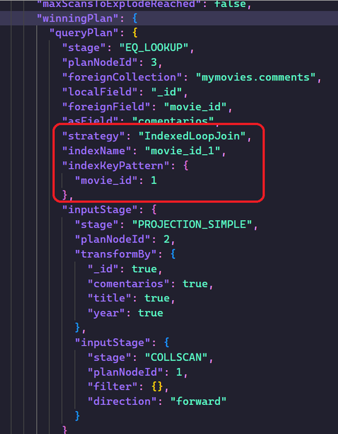
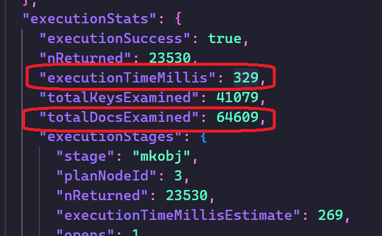
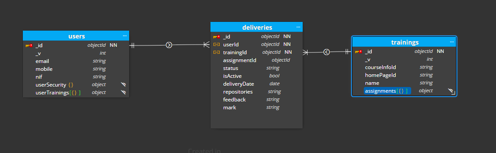
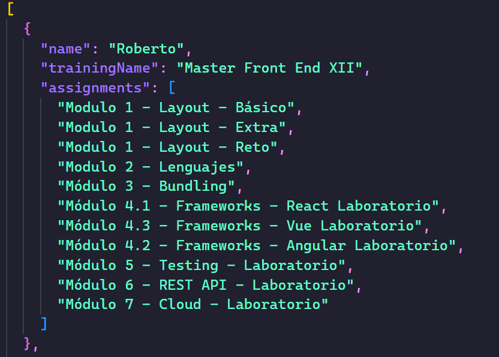
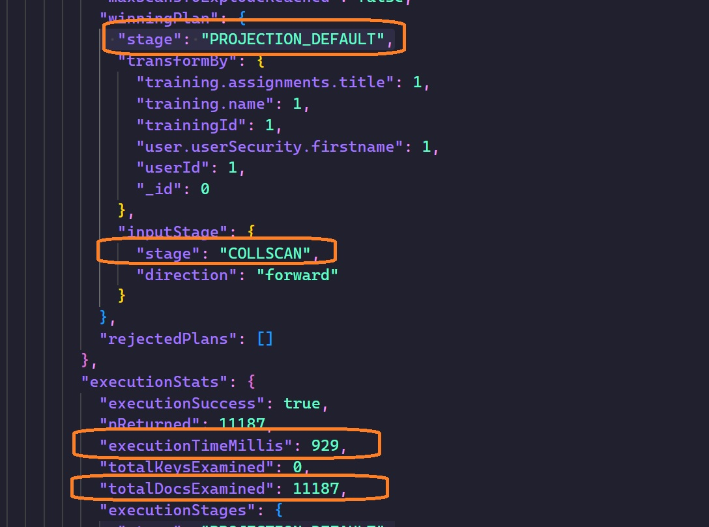

# Queries agregadas

Aggregation optiomization
https://www.mongodb.com/docs/manual/reference/operator/aggregation/project/

## Consejos

1. Project al final??

2. $lookup, lo más tarde posible, antes filtrar

3. Sorting antes del group (después del group no se puede usar indices)

4. Limit si lo podemos usar antes

5. $skip cuanto antes

# A base de ejemplos

# Look up rendimiento

Vamos a hacer ahora un consulta en la que vamos a hacer un lookup, y vamos a ver que pasa con el rendimiento, y como podemos mejorarlo.

Esta sería la consulta:

```mql
use("mymovies")

db.movies.aggregate([
  {
    $lookup: {
      from: "comments",
      localField: "_id",
      foreignField: "movie_id",
      as: "comentarios",
    },
  },
  {
  $project: {
    title: 1,
    comentarios: 1,
    year: 1,
  },
  },
  {
    $addFields: {
    count: { $size: "$comentarios" },
    },
  },
  {
    $match: {
     count: { $gt: 0 },
    },
  },
 ]).explain("executionStats")
```

Vamos a ejecutar la consulta y a ver que pasa:

La consulta, con el explain, se queda colgada, y no termina nunca. 

¿Qué ha podido suceder?


1. En este caso, el problema se podía haber arreglado en fase de modelado, agregando un campo calculado comentarios (true/false) en la colección de movies, y así no tener que hacer el lookup.
2. Al hacer un lookup estamos recorriendo sobre campo movie_id de comment y tenemos un _collscan_ en comments, que es lo que nos esta matando el rendimiento.
3. Que podemos hacer: vamos a probar crear un índice en la colección de comments, sobre el campo movie_id, y vamos a ver que pasa.

```mql
db.comments.createIndex({ movie_id: 1 });
```

Volvemos a ejecutar la query y vemos que pasa:



Vemos que ahora si que se usa el índice, y el rendimiento es mucho mejor.

La etapa principal de la consulta es un "Indexed Loop Join" (unión de bucle indexado), que utiliza un índice llamado "movie_id_1" en la colección "comments" para mejorar el rendimiento de la unión.

Por otra parte, vemos el tiempo de ejecución de la consulta, que es de 329 segundos, y el número de documentos examinados, que es de 64609.



Siguiente ejemplo una consulta con dos lookups, sin índices poner dos índices y ver si se usan los índices.

Vamos a trabajar sobre un campus que que tiene el siguiente modelado:



Vamos a hacer una consulta, que partiendo de la colección de _deliveries_ (entregas), queremos que nos devuelva la lista de los alumnos que están cursando el _training_ (curso) Máster Front End XII, y ver todos los _assignments_ (ejercicios) que ha entregado.

Para esto vamos a hacer un _lookup_ sobre la colección de _users_ para traernos el nombre del alumno, y otro _lookup_ sobre la colección de _trainings_ para traernos un array de los _assignments_ que tiene entregados el alumno.

```mql
use("campus")

db.deliveries.aggregate(
  [
    {
      $lookup: {
        from: "users",
        localField: "userId",
        foreignField: "_id",
        as: "user",
      },
    },
    {
      $unwind: {
        path: "$user",
      },
    },
    {
      $lookup: {
        from: "trainings",
        localField: "trainingId",
        foreignField: "_id",
        as: "training",
      },
    },
    {
      $unwind: {
        path: "$training",
      },
    },
    {
      $match: {
        "training.name": "Master Front End XII",
      },
    },
    {
      $project: {
        _id: 0,
        name: "$user.userSecurity.firstname",
        trainingName: "$training.name",
        assignments: "$training.assignments.title",
      },
    },
  ]
)
```

Vamos a ejecutar la consulta y a ver que pasa:



Vamos ahora a usar el explain para ver que pasa:

```mql
use("campus")

db.deliveries.aggregate(
  [
    {
      $lookup: {
        from: "users",
        localField: "userId",
        foreignField: "_id",
        as: "user",
      },
    },
    {
      $unwind: {
        path: "$user",
      },
    },
    {
      $lookup: {
        from: "trainings",
        localField: "trainingId",
        foreignField: "_id",
        as: "training",
      },
    },
    {
      $unwind: {
        path: "$training",
      },
    },
    {
      $match: {
        "training.name": "Master Front End XII",
      },
    },
    {
      $project: {
        _id: 0,
        name: "$user.userSecurity.firstname",
        trainingName: "$training.name",
        assignments: "$training.assignments.title",
      },
    },
  ]
).explain("executionStats")
```

Vemos los siguientes resultados:



Vemos que ha hecho un _collscan_, el tiempo de ejecución ha sido de 929 milisegundos y ha examinado un total de 11187 documentos.

Ahora vamos a crear dos índice en la colección de _deliveries_, uno sobre el campo _userId_ y otro sobre el campo _trainingId_.

```mql
db.deliveries.createIndex({ userId: 1 });
db.deliveries.createIndex({ trainingId: 1 });
```

Vamos a ejecutar la consulta y a ver que pasa ahora:

Y si creamos un índice compuesto sobre los campos _userId_ y _trainingId_:

```mql
db.deliveries.createIndex({ userId: 1, trainingId: 1 });
```

Vamos a ejecutar la consulta y a ver que pasa ahora:


Vemos que todo el rato nos está lanzando resultados parecidos. La creación de índices puede mejorar significativamente el rendimiento de una consulta, pero también hay muchos factores que pueden influir en el rendimiento de una consulta, como la estructura de la base de datos, la cantidad de datos, el hardware utilizado, la red, etc. 

Si estos índices no han mejorado el rendimiento de la consulta, puede intentar explorar otras soluciones, como ajustar el tamaño de la memoria caché, actualizar el hardware utilizado, revisar la estructura de la base de datos y los índices existentes.

## Project al final

\_\_ Decir que mymovies

Primera consulta

```mql
use("mymovies")

db.movies
 .aggregate([
 { $match: { countries: "Spain" } },
 { $project: { title: 1, countries: 1 } },
 ]).explain("executionStats")
```

Cpomentar COLLSCAN, tiempo ejecucion, etc...

Creamos un indice por countries

\_\_\_Comando aqui ( mongo compass)

Vemos que se usa

Cambiamos el orden

```
use("mymovies")

db.movies
 .aggregate([
 { $project: { title: 1, countries: 1 } },
 { $match: { countries: "Spain" } },
 ]).explain("executionStats")
```

Comentar que no se usa el indice !! NOPES

--> Braulio ver mejoras project en versiones modernas

# Material

Material interesante: https://medium.com/mongodb-performance-tuning/optimizing-the-order-of-aggregation-pipelines-44c7e3f4d5dd

https://medium.com/@abhidas/improving-the-performance-of-mongodb-aggregation-d223a2b19f11

https://www.practical-mongodb-aggregations.com/guides/performance.html

Db Koda

https://www.dbkoda.com/aggregation

Optimizaciones automáticas

https://www.xuchao.org/docs/mongodb/core/aggregation-pipeline-optimization.html

Muy bueno este caso real

https://stackoverflow.com/questions/62368259/mongo-aggregate-query-optimization

Este es mas normalito

http://oracleappshelp.com/mongodb-aggregation-pipeline-optimization/

Este se ve raro

https://github.com/mongodb/docs/blob/master/source/core/aggregation-pipeline-optimization.txt
